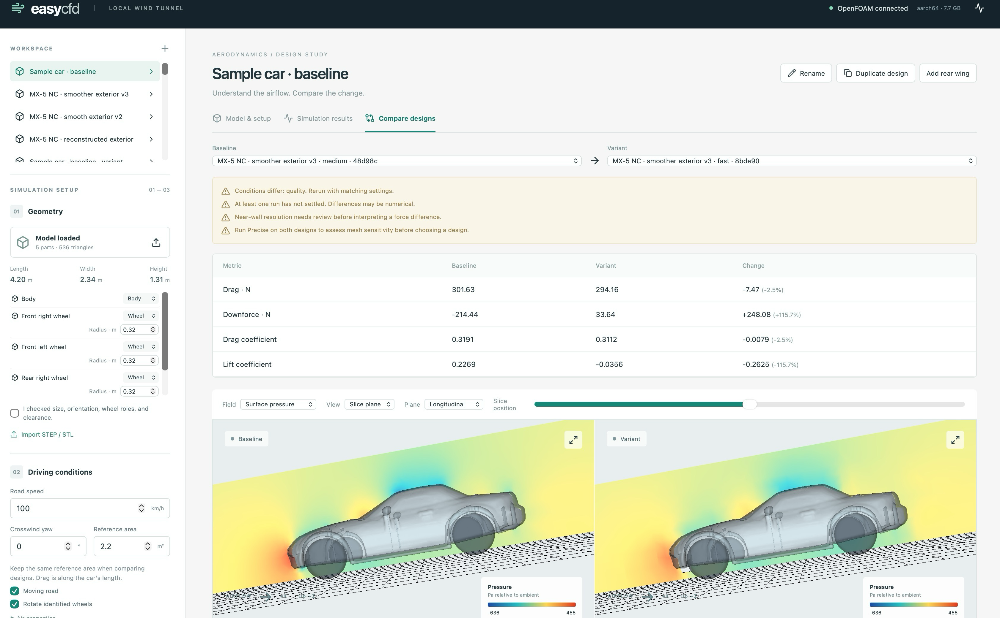

# Easy CFD

A local virtual wind tunnel for importing car geometry, running OpenFOAM, and comparing designs. The browser displays calculated fields and forces. It never fills in missing results with generated pictures or synthetic numbers.



MX-5 NC model by [Nieve5677](https://sketchfab.com/iori308408), [CC BY 4.0](https://creativecommons.org/licenses/by/4.0/); [source and geometry modifications](docs/mx5-nc.md).

## Install and start

```sh
./scripts/start.sh
```

Open **http://127.0.0.1:8000**. You can also double-click **Start Easy CFD.command** in Finder. Keep the terminal open while simulations run. Stop with Ctrl-C.

For a fresh installation, install these prerequisites:

- [uv](https://docs.astral.sh/uv/) for Python. The project uses Python 3.12.
- Node.js 22 or later and npm.
- A Docker-compatible container runtime. [Colima](https://github.com/abiosoft/colima) is an open-source option for macOS. Allocate about 8 GB and at least 4 CPUs to its Linux VM on a 16 GB Mac, leaving memory for macOS (for example `colima start --cpu 4 --memory 8`). An existing Docker runtime also works.

Then run:

```sh
./scripts/setup.sh
./scripts/start.sh
```

Setup downloads Python/JavaScript dependencies and a pinned OpenCFD OpenFOAM 2412 image. Internet access is needed during setup. Models and simulations remain local. The solver container runs without network access, and the browser loads no external fonts, analytics, or cloud services.

Linux uses the same scripts with Docker Engine. Windows support means running the project inside WSL2 with a Docker-compatible Linux runtime; native Windows is not supported. macOS ARM64 is the tested platform.

## First comparison

1. Click **+** beside Designs to open the sample car. The sidebar holds **01 Geometry**, **02 Driving conditions**, and a **03 Run** area that stays in view; the icon at the top right switches between system, light, and dark themes.
2. Rotate it and check its dimensions. The nose points toward −X, incoming air travels toward +X, and +Z is up.
3. Confirm the geometry checklist. Set road speed and reference area.
4. Select **Fast** and run. Inspect pressure, flow lines, and velocity slices.
5. Duplicate the design, then add the rear wing or import your own complete modified assembly. For your own model, **Add parts** loads optional pieces such as wings or splitters into the same design; switch them on or off before each run.
6. Keep the driving conditions and reference area the same. Run the variant and choose both completed runs in **Compare designs**.
7. Use **Medium**, then **Precise**, before drawing conclusions about forces. Review the mesh, force history, residuals, near-wall resolution, and changes between mesh levels.

The included car and removable wing are original, simplified demonstration geometry. They are not a production car, optimized aerofoil, or experimental benchmark. Wheels are separate cylinders with simplified road clearance and no spokes or contact deformation.

## Importing geometry

For Blender models, open **Blender export guide** in the page header or import dialog. The six-step guide covers scale, separate wheels, closed surfaces, mesh checks, STL export settings, and import. It was checked against the Blender 5.2.2 LTS manual on 22 September 2026.

- **STEP / STP:** Open CASCADE reads embedded length units, tessellates the solids, then converts millimetres to metres internally.
- **STL:** Select export units explicitly. STL does not reliably encode units.
- Import all assembly files together so their relative positions are preserved. Imports replace the current project geometry, while previous run snapshots remain intact.
- Choose the original forward and up axes. The app centers the assembly horizontally and places its lowest point at the requested distance above the road.
- Original files are kept with the design. After import, **Turn 90°**, **Nose ↔ tail**, **Pitch 90°**, **Flip**, STL units, and road clearance rebuild the model from them without uploading again. Hints suggest a fix when the bounding box looks wrong, for example a car wider than it is long or a length that fits another unit. They are suggestions from the bounding box only and are applied only when you choose them.
- **Add parts** imports optional parts exported from the same scene as the car, without moving the car. They use the car's units and axes, and keep their exported position: they are not re-centered or placed on the road. A part that reaches within 5 mm of the road blocks the run.
- Each file and part can be switched off. Switched-off parts stay in the design, appear faint in the preview, and are left out of the simulation, dimensions, frontal-area estimate, and geometry checks. Each run keeps only the parts it simulated. Run labels and **Compare designs** name the parts that differ.
- **Front**, **Side**, and **Top** show orthographic views for checking orientation. The labelled cube shows the car's front, rear, left, and right.
- Identify wheels as separate parts. The initial wheel center comes from that part's bounding box; set its radius in the part list. The wheel axis is transverse to the car, so arbitrary steered or cambered wheels are outside this version's model.
- Export a closed exterior, without cabin furniture, engine internals, or unnecessary fasteners. Fix open edges and incorrect normals in CAD/Blender. Automatic checks do not prove the absence of intersecting surfaces.
- Current import limits are 20 files, 100 MB combined, 100 connected parts, and 1.5 million surface triangles. Supported model lengths are 0.1–15 m.

Confirming geometry is a review step, not a CFD accuracy certificate. Thin parts, narrow gaps, overlapping bodies, and wheel/ground contact can prevent meshing or require more resolution than this Mac's presets provide.

## Quality presets

| Preset | Purpose | Solver RAM cap | Iteration budget |
|---|---|---:|---:|
| Fast | Geometry/setup checks and coarse flow exploration; no prism layers | 3 GB | 300 |
| Medium | Finer surfaces and wake, with prism-layer meshing | 5 GB | 1,000 |
| Precise | Runs Medium followed by a finer mesh with more prism layers | 6 GB | 1,000 + 1,800 |

The app runs one solver job at a time, with a four-CPU container quota. The flow solution uses four MPI processes; meshing and result extraction are separate stages. Actual speedup depends on the case and runtime allocation. A run needs 8 GB of free disk space before it starts. Mesh cell limits are conservative ceilings, not targets. Meshing failures remain visible, with their logs.

Preset names describe effort, not guaranteed accuracy. Local timings and verification evidence are recorded in [docs/validation.md](docs/validation.md). A real detailed car can cost much more than the sample.

## Interpreting results

- **Drag, N:** force along the car's longitudinal +X axis, including at nonzero crosswind yaw.
- **Downforce, N:** negative vertical lift. A negative downforce value means the simulation predicts upward lift.
- **Cd / Cl:** dimensionless forces normalized by `0.5 × density × airspeed² × reference area`. Reference area defaults to 2.2 m² and must be checked for your model. It is not silently recalculated for a variant.
- **Pressure, Pa:** pressure relative to the outlet ambient reference. OpenFOAM's kinematic pressure is multiplied by air density before display.
- **Speed, m/s:** local air velocity magnitude. A stationary no-slip body surface has zero velocity; inspect a slice for air motion around it.
- **Modeled turbulence, m²/s²:** turbulent kinetic energy, `k`. This is a modeled average quantity, not resolved eddies.
- **Flow lines:** streamlines through the steady velocity field. They are not a time history of turbulent motion.

The solver is `simpleFoam` with steady incompressible k–omega SST RANS. Standard air defaults are density 1.225 kg/m³, kinematic viscosity 1.5e-5 m²/s, and 1% inlet turbulence. Yaw adds lateral air velocity while the road and wheels follow longitudinal road speed. The wind tunnel extends three car lengths upstream, six downstream, and two lengths to each side and above the car.

The forces are averaged over the last 50 iterations. “Settled” means the final 50-iteration range is below 2% of the mean magnitude, with a coefficient floor of 0.01. Residual checks are separate. Neither establishes physical accuracy. Precise compares two mesh levels; it does not provide a formal uncertainty interval or establish grid independence.

## Files, recovery, and development

Local state is in `.easycfd/` beside this README. `EASYCFD_DATA` can choose another directory. Projects contain original imports and prepared surfaces. Each run contains an independent geometry snapshot, settings, OpenFOAM dictionaries, logs, solved fields, and visualization assets. Every retained timestep is reassembled after a parallel solve. The per-process copies are then deleted, but only when they hold nothing the reassembled case lacks. The results page shows each completed run's size. **Export run** downloads a ZIP for inspection in other tools, including ParaView.

Runs saved by earlier versions may still hold those per-process copies and old `run.zip` exports. `uv run python scripts/cleanup.py` lists the space they use; add `--apply` to delete them. Earlier versions reassembled only the final timestep, so those copies hold the only copy of the previous one. They are kept unless you add `--reconstruct`, which reassembles those timesteps in the solver container before deleting the copies. Failed and cancelled runs are never touched.

The solver uses four MPI processes. On the tested Apple M1, six or eight were slower. The cause wasn't isolated; efficiency cores, MPI communication and memory bandwidth are all candidates. On a machine with more performance cores, set `EASYCFD_PROCESSES` before `./scripts/start.sh` and compare solver times. Docker's CPU limit never exceeds the runtime's CPU count.

On a server restart, queued jobs resume; an interrupted active run is marked failed and its logs are retained. Start a fresh run to retry. Cancellation stops the active solver container. Keep one backend server per data directory.

```sh
# Backend checks, without Docker
uv run pytest -q
uv run ruff check backend scripts

# Build the local browser application
npm --prefix frontend run build

# Browser checks, with the local server running
cd frontend
npx playwright install chromium
npm run test:e2e

# Real end-to-end CFD, from the repository root with the server running
uv run python scripts/smoke.py --quality fast
uv run python scripts/smoke.py --quality precise
```

For frontend development, run `npm --prefix frontend run dev` alongside the backend; Vite proxies `/api` to port 8000. Interactive API documentation is at http://127.0.0.1:8000/docs. Do not expose this single-user local application on a public network.

## Limits

This release is for design exploration. It is not a validated automotive aerodynamics package. Cooling/internal flow, heat transfer, deforming parts, moving wheel geometry, adaptive meshing, arbitrary automatic CAD repair, remote compute, and transient LES/DES are not implemented. Detailed whole-car accuracy may require substantially more computation and specialist setup than the local presets support.

Before using a predicted improvement, verify that it survives mesh refinement and a suitable experimental benchmark. See [validation evidence and remaining work](docs/validation.md).

## Open-source components

Application code and original sample geometry are MIT-licensed. OpenFOAM remains a separately distributed GPL component in its upstream container. Dependencies retain their own licenses; see [THIRD_PARTY.md](THIRD_PARTY.md).

## Private Tailscale access

You can optionally serve the UI privately with `tailscale serve --bg --https=8443 http://127.0.0.1:8000`. Connect the testing device to your tailnet and use the host's Tailscale DNS name with `:8443`.

Save the exact HTTPS browser origin (including port 8443) in `.easycfd/tailnet-origin`; it is loaded by `scripts/start.sh` on startup. To disable the proxy, run `tailscale serve --https=8443 off`. This uses private Tailscale Serve, not public Funnel.

## MX-5 NC example

The development validation used a separately supplied MX-5 NC model. Its geometry and local projects are not bundled with this repository. The first coarse reconstruction was superseded by a smoother exterior. See [surface-quality checks and limitations](docs/mx5-nc-surface-quality.md).
