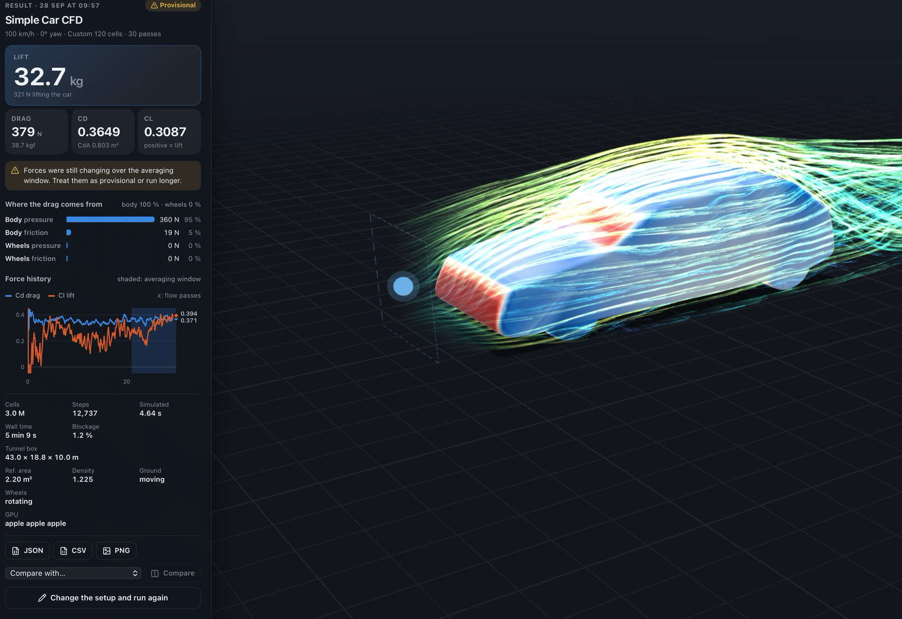
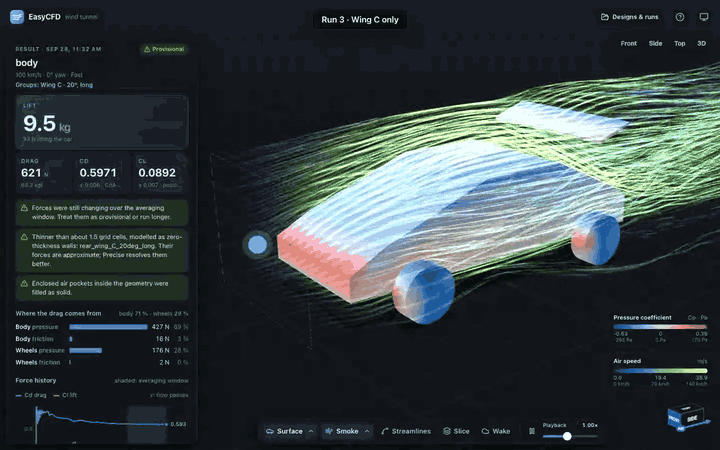

# EasyCFD

A virtual wind tunnel for cars that runs entirely in the browser. Drop in a car, choose a speed, and the airflow is computed on your own graphics card through WebGPU. There is no server, no Docker and no OpenFOAM: the app is a folder of static files, and your geometry never leaves the computer.



The browser version in [`web/`](web/README.md) is the primary EasyCFD tool. The original OpenFOAM version is kept intact as the [legacy version](#legacy-openfoam-version) for cross-checking final designs.

## Start

```sh
just run            # browser version: builds web/ and serves http://127.0.0.1:4173
just run-openfoam   # legacy OpenFOAM version: http://127.0.0.1:8000
```

`just run` needs Node.js 22+ and Python 3 (for the static file server). It installs the npm packages on first use. Open the page in Chrome or Edge 113+, or Safari 26+. The app tells you if WebGPU is missing, or if the browser only offers a slow software fallback. Without `just`: `cd web && npm install && npm run build`, then serve `web/dist` from any static web server over `https://` or `http://localhost`.

## Using it

1. **Car.** Drop STL, OBJ, GLB or glTF files anywhere on the page, or open the sample car. Set units, which way the nose points, which way is up, and road clearance. Check the wheels and confirm the checklist.
2. **Conditions.** Road speed (5–300 km/h), crosswind yaw (±20°), reference area (with an exact frontal-area estimate), air density, moving road, rotating wheels, and an automatic or custom tunnel box.
3. **Run.** Fast (about 1 minute on an Apple M1), Medium (1–2 minutes), Precise (two grid levels, 3–5 minutes) or Custom. The flow develops live on screen while the forces converge.
4. **Results.** Lift or downforce in kg and N, drag, Cd and Cl with a ± band, where the drag comes from, force history and warnings. Visualise surface pressure, smoke, streamlines, a section plane and the wake volume.
5. **Compare.** Two runs side by side with synchronised cameras, shared colour scales, force deltas and the parts or groups that differ.

Designs and runs are saved in the browser (IndexedDB). Runs can be exported as JSON with a CSV of the force history, and views as PNG.

### Part groups: test variants without re-importing

Parts are organised in groups that are switched on and off together, so several versions of a part can live in one design:

- **Automatic groups.** Body and Wheels. Aero parts are recognised by name (wings, endplates and wing supports go into "Rear wing"; also splitters and diffusers). Every file added with **Add parts** gets its own group.
- **Your own groups.** Click a group's name to rename it. Use **New group**, or the menu on each part row, to move parts into another group. Deleting a group returns its parts to their automatic groups.
- **Switches.** A part is simulated when both its own switch and its group's switch are on. **Only this** switches one optional group on and the other optional groups off; Body and Wheels are left alone. This is the quick way to cycle through wing versions.
- **Runs remember their groups.** Results, the run list and **Compare** name the groups each run simulated, for example "Groups: Wing A · 12°" against "no optional groups".

Typical workflow: import the car, then add three rear-wing versions with **Add parts** (each becomes a group). Run the baseline with the wing groups off, then **Only this** on each wing in turn, and compare the runs.

[](web/docs/groups-walkthrough.mp4)

[Watch the part-groups walkthrough](web/docs/groups-walkthrough.mp4) (2 min 20 s; the three solver runs are sped up 6×). It uses the synthetic demo geometry in [`web/demo/groups`](web/demo/groups/README.md).

## Accuracy

The browser solver was checked against the OpenFOAM app on eight cases, using the same geometry and conditions: the sample car (also at 10° yaw and with a rear wing), an MX-5, two BMW Z4 versions, a simple one-piece car and the Ahmed body. Drag is within ±10 % of OpenFOAM Medium for 6 of 8 cases on Fast, and 5 of 8 on Medium and Precise. All are within 16 %. On average the browser's drag is about 9 % lower. Lift is less reliable: it is 0.2–0.3 off in Cl on four models. The full tables, sensitivity studies and reproduction steps are in [web/VALIDATION.md](web/VALIDATION.md).

On the sample car in the app: Fast gave Cd 0.511 ± 0.006 and Cl 0.839 in 61 s; Medium gave Cd 0.513 ± 0.001 and Cl 0.845 in 108 s. OpenFOAM Medium gives Cd 0.547.

### Lift that does not settle on fine grids

On fine grids some cars have no steady answer for lift. On the simple car at 120 cells per car length, lift keeps swinging between about 0.15 and 0.44, with a period of 8–10 flow passes, while drag stays within about ±3 %. At 72 cells per length the same car converges: lift settles at 0.22–0.25. The finer grid resolves an unsteady wake that the coarser grid damps. Gentler local time stepping ran twice as slowly and still fluctuated (0.13–0.35) around the same mean, so this is the flow, not a solver setting.

What the app does about it:

- Medium, Precise and Custom runs extend themselves by up to 10 flow passes (or twice their length, if shorter) while Cd or Cl is still drifting, then average over the longer window. Fast is never extended.
- Cd and Cl are shown with a ± band: half the range of six sub-window means over the averaging window.

How to read it: use 72–100 cells per car length for design comparisons. Compare designs on drag first, and treat lift differences smaller than the ± band as noise. At 120+ cells, report the average and its band.

## How the solver works

Steady incompressible RANS with the k-ω SST turbulence model, the same model and boundary conditions as the OpenFOAM version: a fixed-velocity inlet with 1 % turbulence, a fixed-pressure outlet, freestream sides, a symmetry top, a moving road, rotating wheels and wall functions. It uses a stretched Cartesian grid with cut cells, so sloped and curved surfaces are smooth rather than stepped. Small cut cells are merged with a neighbour, and thin parts such as wings are zero-thickness walls. The flow is marched to a steady state with local time steps and a multigrid pressure solver, all as WebGPU compute shaders. See [web/README.md](web/README.md) for details and development commands.

## Legacy OpenFOAM version

The original app is unchanged in `backend/`, `frontend/` and `scripts/`. It runs OpenFOAM v2412 in Docker and includes the tools the browser version does not have yet: STEP import, opening repair, merge & seal, and rotate & scale. Use it to cross-check final designs with an independent solver and mesh.

```sh
./scripts/setup.sh    # first time: Python/JS dependencies and the pinned OpenFOAM image
just run-openfoam     # or ./scripts/start.sh
```

Its full documentation is in [docs/legacy-openfoam.md](docs/legacy-openfoam.md).

## Private Tailscale access

Both versions can be shared privately on your tailnet (Tailscale Serve, not public Funnel):

```sh
tailscale serve --bg --https=8444 http://127.0.0.1:4173   # browser version (while `just run` is running)
tailscale serve --bg --https=8443 http://127.0.0.1:8000   # legacy OpenFOAM version
```

For the browser version, the flow is computed on the viewer's device, not the host. Designs are stored per browser. Stop sharing with `tailscale serve --https=8444 off`.

## Licenses

Application code and the original sample geometry are MIT-licensed. The browser version depends on three.js (MIT), React (MIT) and lucide-react (ISC). The legacy version runs OpenFOAM, a separately distributed GPL component in its upstream container. See [THIRD_PARTY.md](THIRD_PARTY.md).
