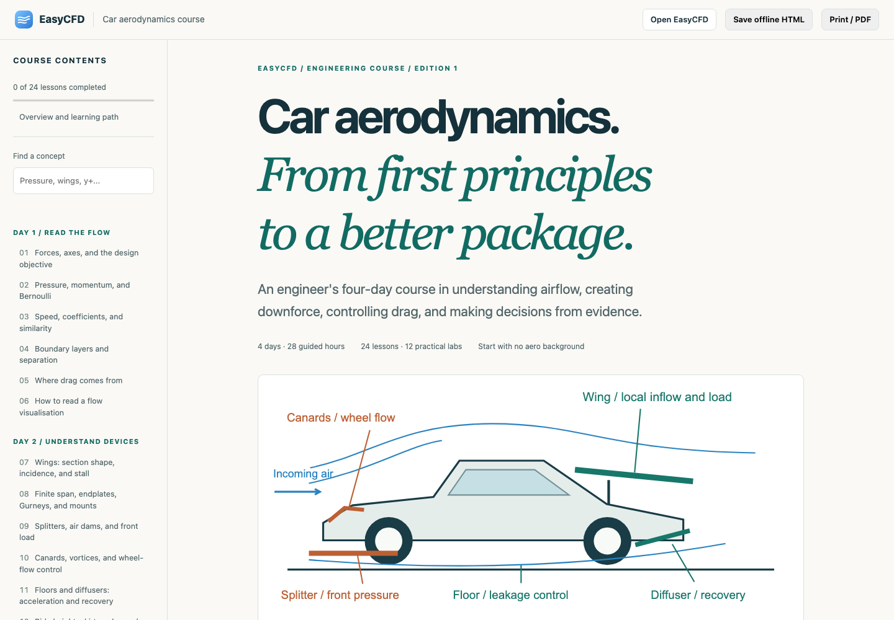

# Car aerodynamics course

An independent HTML course linked from EasyCFD's top bar and start screen. Four days / 28 guided hours, 24 lessons, twelve labs, twelve worked exercises, 29 original static diagrams, two actual solver field views and eight interactive workbenches. The roughly 20,000-word reading starts with no aero prerequisites and progresses to device interactions, numerical verification, axle-load decomposition, operating maps and physical validation.

The review copy is [output/pdf/easycfd-car-aerodynamics.pdf](../../output/pdf/easycfd-car-aerodynamics.pdf). It is printed from the same self-contained HTML, with default workbench values and all answers expanded. The PDF has selectable text, internal links, bookmarks and vector diagrams. The HTML additionally has search, reading progress, a local notebook, downloads and the app launcher.

For an immediate offline copy without an npm build, download [output/html/easycfd-car-aerodynamics.html](../../output/html/easycfd-car-aerodynamics.html) and open it in a browser. This generated review artifact is the same HTML served by the app. Save the PDF beside the HTML if you also want its optional review-PDF download link to work offline.



## Read and reproduce

```sh
cd web
npm ci
npm run dev
# Open http://127.0.0.1:5173/course/index.html
```

Normal dev, build and public-edition build scripts assemble `web/public/course/index.html`. It embeds its own CSS, JavaScript, SVGs, evidence and ZIP download; the downloaded HTML can be opened through `file://` without network access. The optional app and PDF links lead to separate resources. On a local file, app links use the public EasyCFD origin; on the served course they retain the app's relative base path.

```sh
npm run course:build      # regenerate synthetic meshes, ZIP, standalone HTML
npm run course:pdf        # print that exact HTML to output/pdf; copies PDF to served course
npm run course:examples   # rerun nine genuine WebGPU examples; requires a real adapter
node course/capture-views.mjs # separately rerun baseline and capture actual app field views
npm test
VITE_ENABLE_OPENFOAM=false EASYCFD_WEB_TEST_PORT=5300 npm run test:e2e -- --config playwright.course.config.ts
npm run build:webgpu
```

The PDF/HTML generator needs the installed Playwright Chromium browser (`npx playwright install chromium`). Rendering the review copy for visual inspection uses Poppler. The course CI builds both the app and course, checks browser/offline behaviour with software WebGL, prints a review PDF and uploads an artifact. CI does not establish physical or CFD accuracy.

## Authoring and provenance

- `web/course/content.html`: authoritative reading, labs, exercises and source attribution.
- `theme.css`, `diagrams.mjs`, `models.mjs`, `interactives.js`: original print/screen design, SVGs, transparent math and browser interactions.
- `make-models.mjs`: original closed synthetic meshes. Concave polygon triangulation preserves the integrated diffuser throat/ramp; a convex hull would erase it. Before writing each STL, the generator checks finite vertices, two opposite directed incidences per edge, and positive volume. The manifest includes SHA-256 hashes.
- `build.mjs`: deterministic pack ZIP and standalone HTML. Generated public assets are ignored and rebuilt; portable review copies are committed under `output/html/` and `output/pdf/`.
- `run-examples.mjs` and `evidence/runs.json`: nine actual browser-solver cases, base solver commit, adapter, settings, histories, grid identity, force contributions and warnings. The retained runs use 1,474,560 cells on one shared grid, 72 custom cells/length, 10 requested passes, detail off, 100 km/h, Aref 2.2 m² and density 1.225 kg/m³. Several fail temporal settling. Keep those failures visible.
- `capture-views.mjs` and `evidence/viewer-run.json`: a separate baseline rerun through the actual app, saved with its source-file hashes and complete result. Surface-pressure and vertical-streamline screenshots are embedded in the standalone HTML. Its Cd 0.5650 / Cl -0.0240 and failed settling are identified separately from the nine-case table; final snapshots are not mean pressure fields.
- `export-pdf.mjs`: exact HTML-to-PDF reproduction with expanded answers and fresh/default widget state.
- `web/src/course/launcher.ts`: fixed local pack import after `?courseLab=teaching-car`; fetches all files before replacing the active view, preserves the previous design and flushes the new design before reporting success. It never starts a solve automatically.

Keep exactly one body and at most one wing active. The diffuser meshes replace the flat body, rather than adding a ramp inside its volume. Group switches preserve the common grid; part switches can change it. Wing mounts, detailed wheelhouses, realistic tyre contact and cooling paths are omitted. This is teaching geometry, not production-car fitment or construction advice.

The supplied paper is Guerrero, Castilla and Eid (2022), *A Numerical Aerodynamic Analysis on the Effect of Rear Underbody Diffusers on Road Cars*, DOI [10.3390/app12083763](https://www.mdpi.com/2076-3417/12/8/3763), CC BY 4.0. Table 3 is transcribed with attribution; positive efficiency and deltas are independently calculated. The course records the paper's boundaries, mesh and symmetry assumptions and its uncompleted experimental validation. The teaching pack and new runs are related mechanism experiments, not a reproduction of that geometry or results. Other linked primary sources support limited definitions or provide further reading; third-party textbook chapters/images are not copied.

## Feature issues

Created from concrete course exercises:

- [#19: reproducible operating maps, static poses and independent road/wind inputs](https://github.com/markthebault/easy-cfd/issues/19).
- [#20: mutually exclusive replacement-body/wing variant sets](https://github.com/markthebault/easy-cfd/issues/20).
- [#21: cooling ducts and radiator pressure loss with mass-flow evidence](https://github.com/markthebault/easy-cfd/issues/21).
- [#22: STL face-winding diagnostics before solving](https://github.com/markthebault/easy-cfd/issues/22).

Related existing requests are linked, not duplicated: [#16 numerical qualification](https://github.com/markthebault/easy-cfd/issues/16) and [#15 complete force/report presentation](https://github.com/markthebault/easy-cfd/issues/15). Issue drafts are retained beside this guide.

## Verification

Course math checks cover signed lift, area changes, speed/power scaling, local wing speed, ideal diffuser recovery, axle force/moment closure, invalid GCI data, wind vectors and Pareto dominance. Retained evidence checks verify normalisation and common-grid identity. Browser checks cover the app entry point, all workbenches, search, saved notes/progress, export without personal notes, phone overflow/navigation, fully offline HTML with disabled storage, valid/failed pack loading, immediate reload after the new design is saved, and print answer expansion/restoration. The existing public-edition check remains in the focused suite.

The local checks passed: 53 unit checks, eight browser checks, and both app-edition builds. The 72-page review PDF was rendered in full and visually reviewed, with tagged text, bookmarks, internal links and complete lesson introductions. Text/page-bound checks found no clipping, replacement glyphs or localhost links. The [verification record](verification.json) includes artifact hashes and the retained run counts. These are functional and document-quality checks; the course simulations remain exploratory and do not qualify aerodynamic loads, variant rankings or manufactured parts.
