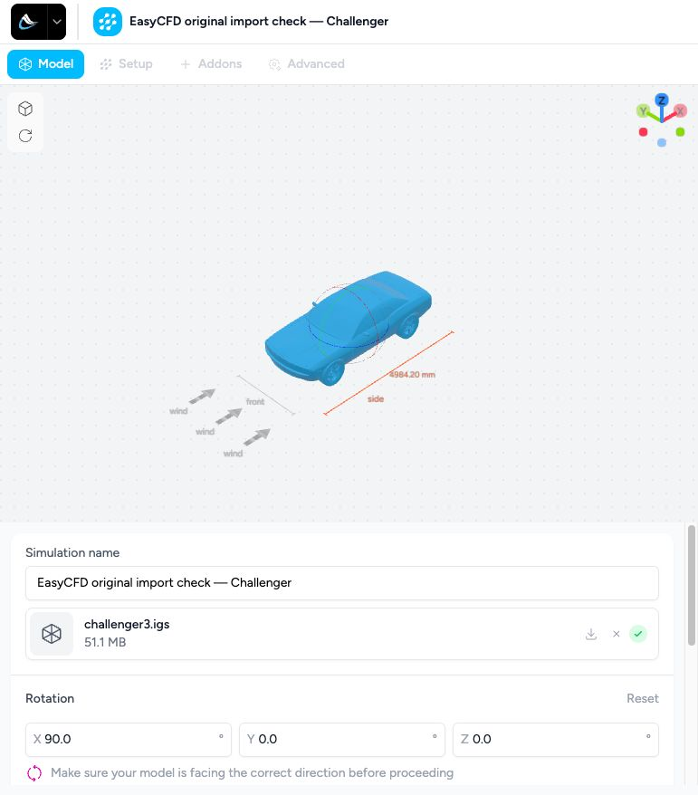
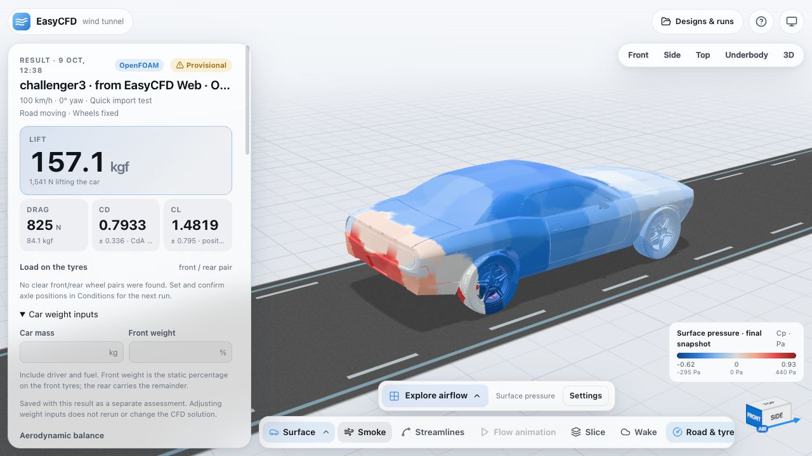
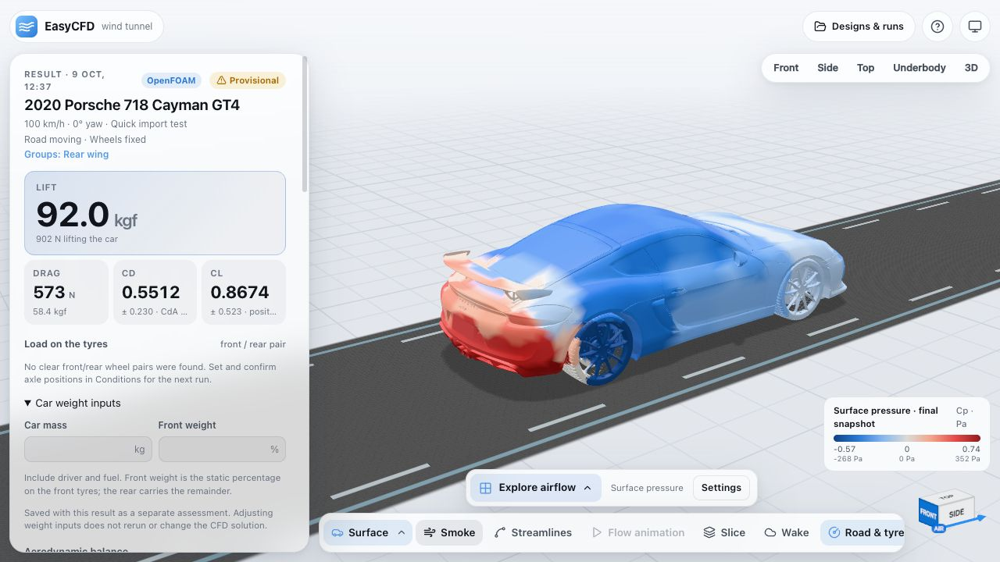
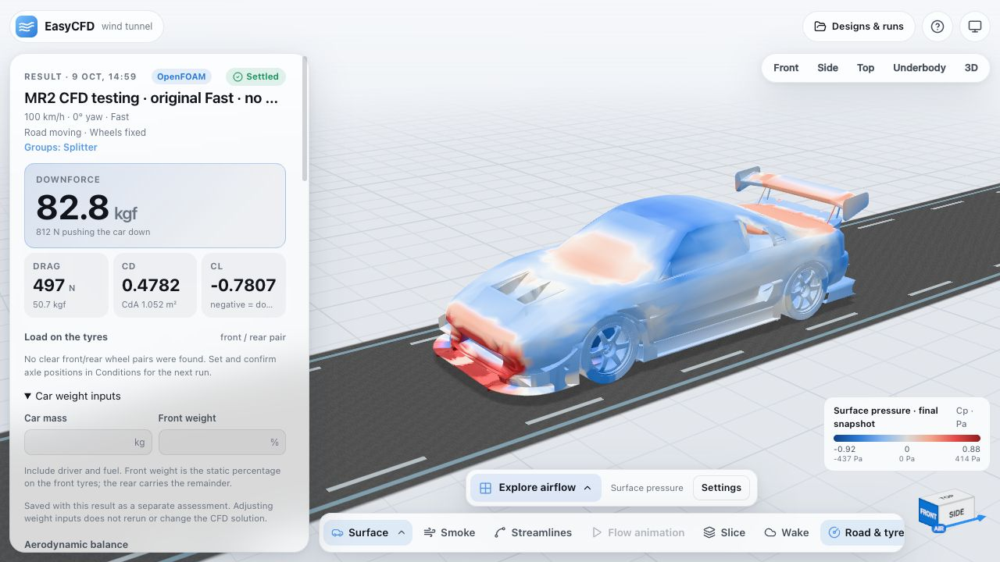
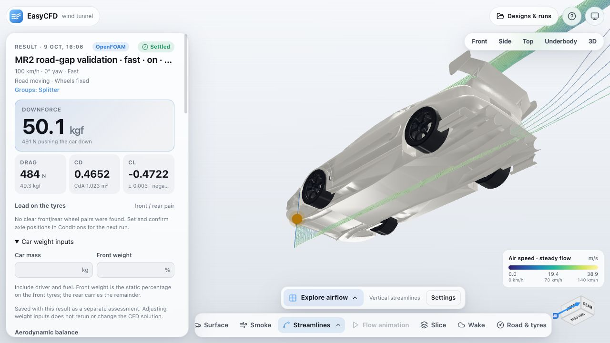

# Original model import comparison — 9 October 2026

AirShaper accepted and rendered all seven supplied original files through Computer Use after the user signed in. EasyCFD now imports those same files and completes a quick OpenFOAM mesh check and 50-iteration run on their original surfaces. None of these seven validation runs uses sealing, voxel reconstruction or an estimated exterior. No AirShaper simulation was started or ordered.

Sources: `~/Library/Mobile Documents/com~apple~CloudDocs/Docs/CFD/Internet Models/`. Downloaded local copies were used for iCloud placeholders. Source files are unchanged. Tests use an isolated backend at http://127.0.0.1:8782/ with data under `/tmp/easycfd-import-parity/data`; the existing persistent preview service and its data were preserved.

| Example | Original file | AirShaper import | Original triangles in EasyCFD | OpenFOAM cells | Run time |
| --- | --- | --- | ---: | ---: | ---: |
| Audi A4 | `sedan.stp` | Accepted | 93,210 | 10,302 | 13.5 s |
| Tesla Model S | `Tesla_base.stp` | Accepted | 157,308 | 9,514 | 23.3 s |
| Porsche 919 Evo | `919_EVO.stp` | Accepted | 364,108 | 11,057 | 12.8 s |
| Mazda RX-8 | `Mazda RX-8 Racecar Model.stl` | Accepted | 299,998 | 10,330 | 8.9 s |
| Porsche 718 Cayman GT4 | `2020 Porsche 718 Cayman GT4.obj` | Accepted | 405,053 | 10,326 | 9.8 s |
| Dodge Challenger | `challenger3.igs` | Accepted | 872,812 | 10,364 | 13.6 s |
| Porsche 987 aero package | `Endplate.step` | Accepted | 340 | 19,751 | 11.5 s |

All seven passed `checkMesh` and completed 50 solver iterations. Times are saved solver start-to-finish, excluding import, CAD tessellation, server geometry preparation and viewer loading. The endplate is the only geometry file supplied in its folder. CAD surfaces are triangulated from the source rather than reconstructed; mesh files retain their surface triangles. Units, orientation and placement above the road remain explicit, editable choices. The Mazda model is approximately 1.16 m long with metre units in both viewers.

## EasyCFD fixes

- STEP/STP and IGES/IGS work in the main browser importer, including the WebGPU edition. Conversion runs locally in a worker with bundled `occt-import-js` assets and a five-minute limit. Embedded CAD units are respected. Zero-area slivers produced by Float32 conversion are omitted, not replaced with new surfaces.
- The original Cayman OBJ mixes faces with decorative lines and points. Three.js previously reclassified some objects as lines and omitted body panels. Ignoring only those non-surface records retains all 405,053 triangles.
- OpenFOAM imports preserve the surfaces without topology, winding, dimension, clearance or wheel-axis acceptance tests. Geometry confirmation and cached legacy errors cannot block a run. File decoding, finite coordinates and host resource limits remain necessary; OpenFOAM runs its own meshing and `checkMesh`. WebGPU keeps its separate checks. Optional inspection and repair tools remain explicit.
- The quick check concatenates enabled original surfaces into one OpenFOAM assembly. This preserves every selected triangle and intentional gap while avoiding a mandatory separate mesh patch for each tiny OBJ fragment. Wheels remain fixed for this check. Normal runs retain separate parts and wheel settings.
- Open panels no longer trigger impossible thickness refinement. The quick preset caps small closed-feature refinement at level 3 and reports underresolved features. Its 0.95 m background spacing, no wake refinement, no layers, 120,000-cell ceiling, 50 iterations and 180-second limit are lighter than Fast. OpenFOAM mesh-quality checks remain enabled.
- Normal runs report small, internal or sheltered parts with fewer than six fluid-facing mesh faces as resolution warnings, with per-part face counts saved in the result. The original Challenger Fast run passed `checkMesh` with 35,097 cells but was previously rejected because a CAD patch had only one face. The completed retry records 13 nonempty patches with one to five faces and 35 parts with no fluid-facing faces. EasyCFD no longer rejects an OpenFOAM-passing mesh on patch face counts. Zero-face parts contribute no forces; sparse-part forces and local flow need resolution review.
- Automatic thin-detail refinement is bounded to two levels beyond the preset's surface level instead of rejecting thin source parts. Fast uses at most level 4; the quick check remains at most level 3. The estimated requested level, actual level and underresolution flag are saved per part, and normal runs report capped detail refinement. This changes volume mesh resolution, not source model geometry; OpenFOAM quality checks still run.
- Large assemblies are sampled once and values mapped back onto their original browser parts. Native wall-stress matching now runs in bounded batches, fixing the original Challenger's viewer memory failure without raising memory limits or changing sampled values.
- The viewer renders both sides of original surfaces. Inward-facing Challenger panels had looked like missing roof and door geometry even though their triangles were present. This is a display change; vertices and face winding are unchanged.
- Failed imports preserve the current design and show a persistent error; progress identifies the file being read.

`Prepare for OpenFOAM` remains an optional, explicit tool that changes a separate copy. It was not used for any run in the table. Earlier prepared Cayman and Challenger experiments are superseded and retained only for traceability in [validation.json](validation.json).

These checks establish import and run compatibility for the seven supplied files. The deliberately coarse results remain diagnostic; small-feature resolution, leakage and convergence still need checking before using forces for design decisions. Import acceptance was the AirShaper comparison; aerodynamic results were not compared.

## Evidence

[validation.json](validation.json) records run IDs, settings, dimensions, triangle counts, mesh checks, timings and warnings. [airshaper-drafts.json](airshaper-drafts.json) links the seven accepted source-file drafts.

- Original comparison checkout: 122 backend tests and 67 browser tests passed.
- Isolated PR on current main: 120 backend tests and 61 browser tests passed; Ruff passed.
- OpenFOAM and WebGPU production builds passed.
- Computer Use: all seven AirShaper originals visibly accepted; EasyCFD originals imported; original Cayman and Challenger solver results opened; Challenger result saved and reopened in the rebuilt production app; original roof and door surfaces visibly retained.
- `git diff --check` passed.

## Challenger Fast retry on Tailscale

The user-reported failed run `8f05d83433b0476ea414d50590768a37` was repeated as `547b82619a57407cba75f3e42f56ed21` on the persistent preview with the exact same settings, all 60 imported parts and all 872,812 original triangles. Every source STL was byte-checked against the failed snapshot. It passed `checkMesh` on 35,097 cells, completed 300 iterations and saved the coverage diagnostics. No model reconstruction or simplification was used. See [retry evidence](challenger-fast-retry.json). The updated backend passes 126 tests and Ruff.

## MR2 Fast thin-part retry on Tailscale

Run `c250c840856c412b959ea53ffe6cb5b3` failed during dictionary generation: two roughly 7.5 mm-thick closed parts requested refinement level 8, above the old hard limit of 7. The normal Fast retry `b92e83be660c4da3a5ccadcd82e509f0` used the exact failed-run settings (including fixed wheels), all 18 original imported parts and 24,178 triangles. Each imported part STL was byte-checked across the failed snapshot, retry snapshot and solver input. No source geometry was simplified, sealed or reconstructed. The new automatic detail bound is level 4 for Fast; nine parts record capped refinement, including both thin parts. This affects volume mesh resolution, not original surface triangles.

The deployed code `584d8c3` passed `checkMesh` on 60,825 cells and completed all 300 iterations. Thin-feature resolution remains diagnostic. See [retry evidence](mr2-fast-retry.json). The backend suite passes 132 tests, including thin-part preservation and bounded refinement across Fast, Medium and Precise.

## Full MR2 Fast retry without geometry preflight

The 33-part `MR2 CFD testing.stp` failed before queueing because server batch uploads re-centred the assembly from the first 20 parts. Four later wheel parts arrived with a minimum Z of +0.005 m but were shifted to −0.05552448 m. Quick import test used one assembly and avoided this bug.

Browser transport now preserves the already positioned coordinates across every batch, and uses a new cache namespace so old shifted server projects are not reused. The OpenFOAM path skips geometry acceptance diagnostics, clearance/size/axis errors, the manual confirmation requirement, cached legacy errors and settings-time mesh-layout preflight. Low prism-layer coverage is diagnostic, rather than another EasyCFD rejection of an OpenFOAM-passing mesh. File decoding and resource ceilings remain; `checkMesh` is an OpenFOAM operation after meshing.

Computer Use imported the unchanged original STEP, kept all 33 parts and 275,149 triangles, left geometry confirmation unchecked, and started normal Fast (not Quick import test), at 100 km/h, zero yaw, moving road and fixed wheels. The source uploads match the earlier uploads exactly, including their +0.005 m road placement. Maximum transport-coordinate difference is 7.97e-11 m from STL serialization; source surfaces were not sealed, simplified or reconstructed. Every solver input STL is byte-identical to its run snapshot.

Deployed code `177fc85` passed `checkMesh` on 34,017 cells and completed all 300 iterations as run `d9ec04713327409cb79e635092af094a`. The UI opened the computed result. These are coarse setup results, with sparse/absent part coverage still reported. The original failed-run settings were not saved because it failed before queueing; this is a normal Fast retry of the same original surfaces, rather than an assertion of identical unavailable settings. See [coordinate and run evidence](mr2-no-preflight-retry.json).

Validation at that revision: 133 backend tests, 62 browser unit tests, Ruff, OpenFOAM and WebGPU production builds, and working-diff whitespace checks passed. The deployed code's GitGuardian check reports success.

## Underfloor and road flow — 9 October 2026

Low streamlines were falling through the road because volume cell-to-point averaging exported a downward velocity at road vertices. OpenFOAM's actual road boundary sets vertical velocity to zero. The viewer now restores that boundary before interpolation, including moving and stationary roads; it changes neither native cell values nor saved forces or fluid validity. Server field caches and old browser field caches refresh independently of the original simulation.

Fast and Medium now refine a shallow band under the original car footprint at level four. On this MR2 the final region is 126 mm high in Fast and 84 mm in Medium, with 5% footprint padding and nominal cell spacing of 43 mm / 39 mm respectively. There is no geometry repair, new geometry rejection, added iteration count or larger run budget. The UI exposes **Underfloor and road gap**, enabled by default; advanced refinement and Quick import test retain their earlier behavior. Timing estimates separate enabled/disabled refinement and exclude older solver versions.

Full-preset timing comparisons used the unchanged 33-part, 275,149-triangle MR2 at 100 km/h, zero yaw, moving road and fixed wheels:

| Preset | Refinement off | Refinement on | Added time |
| --- | --- | --- | --- |
| Fast | 0 min 57 s / 34,017 cells | 2 min 26 s / 63,239 cells | 1 min 29 s |
| Medium | 4 min 52 s / 83,797 cells | 6 min 28 s / 101,767 cells | 1 min 36 s |

These are complete normal Fast (300 iterations) and Medium (600 iterations) runs, including meshing and backend result extraction. Browser downloads/rendering are excluded. No test suite, result sampler or competing solver ran during these final timing pairs. The last change only narrowed the enabled Medium region: regeneration confirmed all 47 static input files for each earlier Fast run and the Medium baseline still match the final code byte-for-byte. All four passed OpenFOAM's checkMesh and retained byte-identical original geometry and solver-input STLs. Two larger Medium regions were cancelled by the agent during timing experiments and replaced by the shallow final region. Neither cancellation was a solver failure.

Computed low streamlines now pass under the body and continue into the wake. The screenshot uses 64 display seeds; density only resamples the saved computed velocity. Use **Vertical streamlines** and the **Underbody** camera to see paths hidden by the side panels. These remain rough flow explorations: the test establishes mesh/run/display behavior and measured cost on one original model, not accurate underfloor forces or a guaranteed runtime on every internet model.

Validation: 141 backend tests, 63 browser unit tests, Ruff, both production builds and working-diff whitespace checks passed. [Detailed run and sampling evidence](underfloor-validation.json).

