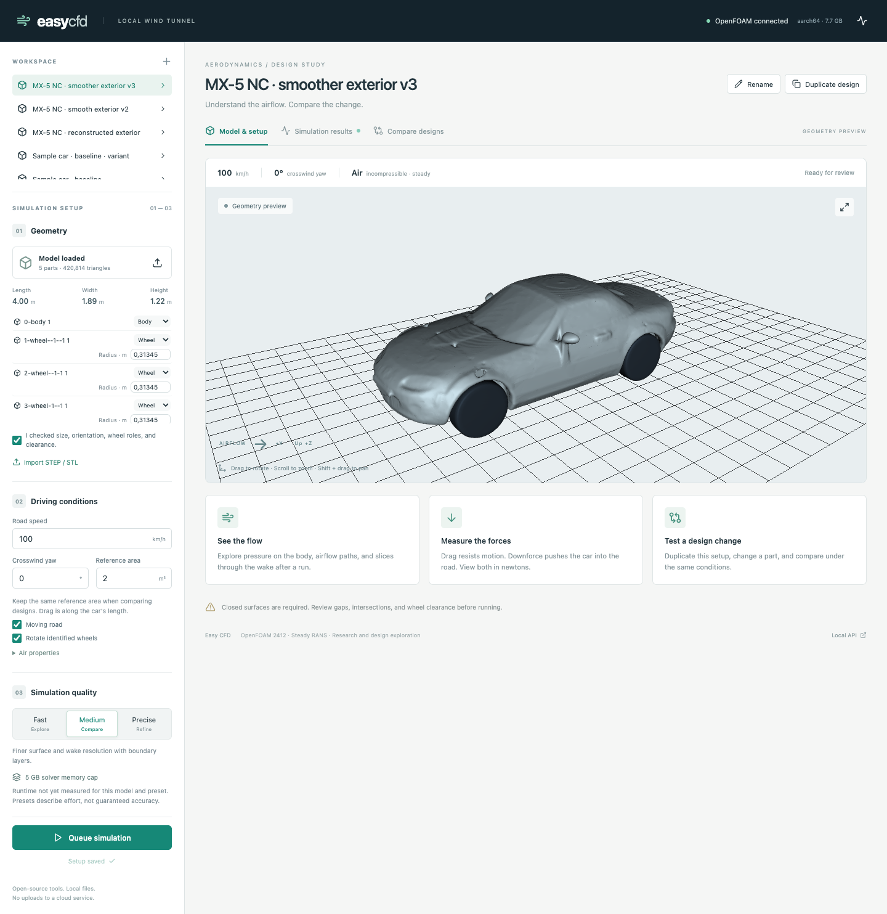
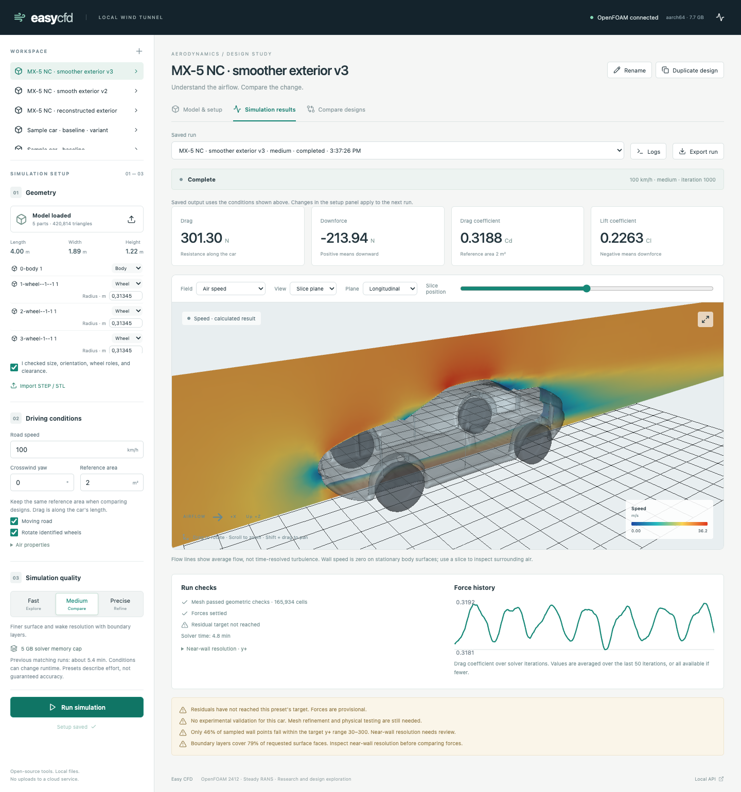

# MX-5 NC surface-quality revision

The first conversion introduced visible terraces. Its 10 mm binary voxel reconstruction was too coarse to represent the body smoothly. Those STL surfaces should not be treated as faithful NC bodywork.

## Current revision

Use **MX-5 NC · smoother exterior v3** in the app. The earlier projects and runs are retained for comparison.

The final pipeline starts again from the original GLB and rebuilds the closed exterior on a 6 mm lattice. Before extracting triangles, it filters the occupancy field with a Gaussian of sigma 2.5 cells, or 15 mm. The resulting continuous isosurface replaces the binary stair steps. Topology-preserving reduction keeps the mesh manageable. It contains 420,814 triangles across the body and four tires, with all five parts closed.

This changes the STL used by OpenFOAM. Separately, geometry VTP previews now include point normals for smooth lighting. Display normals do not alter CFD geometry. A camera-loading race was also fixed: an interrupted initial load no longer saves the default camera from inside the car.

The smoothing necessarily rounds small details, so this is a better approximation, not engineering CAD. It retains the reconstructed floor, cabin closure, wheel housings, simplified tires, and uncalibrated centimetre assumption documented in [the first conversion](mx5-nc.md). The mirrors and fine trim are approximate. Overall dimensions are approximately 4.002 × 1.895 × 1.221 m.

## Checks against the original model

`scripts/models/check_mx5_surface.py` uses 2,000 deterministic, area-weighted face samples in each selected broad bonnet and roof region. It compares triangle-centre distance and face-normal angle against the nearest original exterior triangle. Angles use the absolute normal dot product to avoid treating reversed source normals as geometric error. These are sampled geometric diagnostics, not a complete surface-distance bound or a validation of the real car.

| Diagnostic | First conversion | Current revision |
|---|---:|---:|
| Bonnet distance, median / 95th percentile | 5.77 / 9.75 mm | 3.09 / 4.40 mm |
| Roof distance, median / 95th percentile | 5.43 / 9.00 mm | 3.03 / 4.37 mm |
| Bonnet normal difference, median / 95th percentile | 7.60° / 51.24° | 1.98° / 10.69° |
| Roof normal difference, median / 95th percentile | 5.39° / 28.69° | 1.89° / 5.87° |

The improvement is present in the mesh geometry and is not solely a lighting change. It does not establish accuracy for mirrors, wheel cavities, panel gaps, or the underbody. Direct automatic panel stitching and unconstrained surface fitting produced distorted candidates and were rejected.

## Reproduce

With the original local data from the first conversion present:

```sh
uv run python scripts/models/refine_mx5_nc.py
uv run python scripts/models/check_mx5_surface.py
MX5_DATA_ROOT=.easycfd/imports/mx5-nc-surface \
MX5_NAME='MX-5 NC · smoother exterior v3' \
MX5_SCREENSHOT_PREFIX=docs/mx5-nc-v3 \
MX5_QUALITY=medium node scripts/models/test_mx5_ui.mjs
```

The UI test imports the prepared STLs, sets orientation and wheel roles, submits a real Medium job, and checks pressure and velocity views. It requires the running server. The source GLB and previous conversions are preserved; the derived model retains Nieve5677's CC BY 4.0 attribution.

A dependable component comparison still needs faithful exterior/underbody geometry, adequate near-wall meshing, and convergence/refinement checks. Better-looking bodywork alone is not sufficient.

## Completed CFD and browser verification

Run `fafc3ed8862146f792054297cf12d95b` completed 1,000 Medium iterations with 165,934 cells. Conditions match the first run: 100 km/h, zero yaw, moving road, rotating tire envelopes, and an assumed reference area of 2.0 m². No mesh-quality threshold was relaxed.

| Diagnostic | First conversion | Current revision |
|---|---:|---:|
| Boundary-layer coverage | 56.1% | 78.6% |
| Wall samples in target y+ range | 36.2% | 46.5% |
| Force-stability check | Failed | Passed |
| Residual-convergence check | Failed | Failed |

The new run's provisional Cd is 0.31876, drag 301.30 N, and upward lift 213.94 N. These values are not evidence of an aerodynamic improvement: the geometry preparation changed, and the residual target still failed. Near-wall resolution remains inadequate for a confident force comparison. Meshing took 29.0 seconds and the solver 288.3 seconds on this machine during testing.

The app was checked through Tailscale HTTPS in Chromium: import, five-part geometry display, real solver submission, pressure, velocity slice, streamlines, and rotation all worked without browser errors. All 20 backend tests passed. The new interrupted-loading camera regression and existing result-view browser tests passed, and the frontend build passed.




