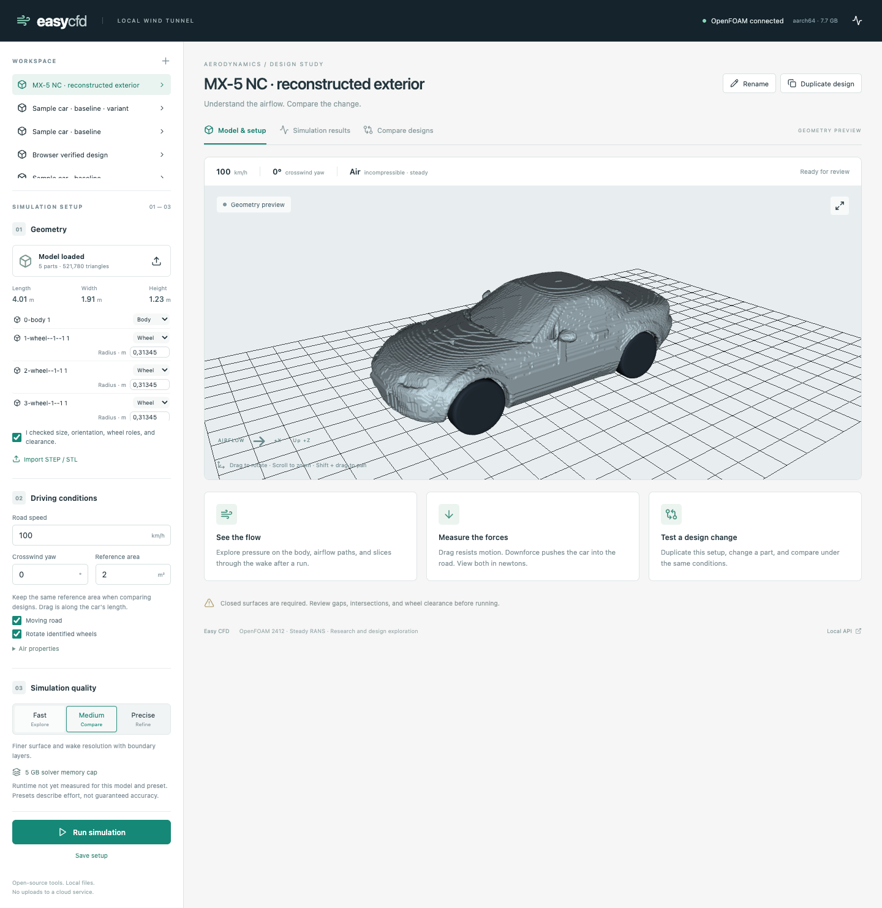
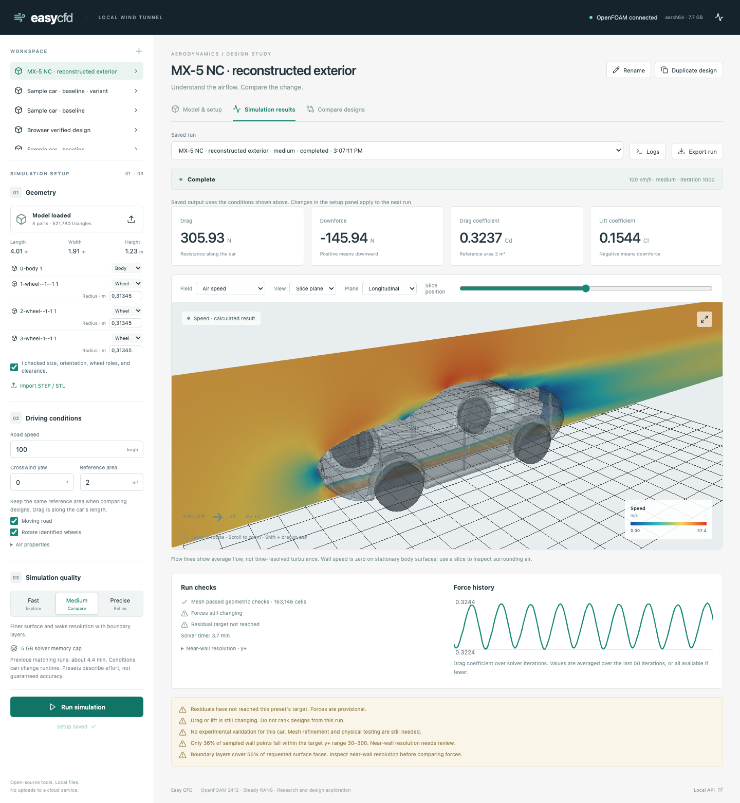

# MX-5 NC conversion and test

**This first preparation is superseded by the [surface-quality revision](mx5-nc-surface-quality.md).** Its results are retained as historical evidence.

The user supplied `mx5 nc glb format.zip`, containing `mazda_miata_mx-5_roadster_2009.glb`. The source is preserved under `.easycfd/imports/mx5-nc/source.glb`.

The GLB embeds this attribution:

- **Mazda Miata MX-5 Roadster 2009**, by **Nieve5677**.
- [Original model](https://sketchfab.com/3d-models/mazda-miata-mx-5-roadster-2009-6043376527844ec9ae85ac46b322b71d).
- [Author](https://sketchfab.com/iori308408).
- [CC BY 4.0](https://creativecommons.org/licenses/by/4.0/).

The converted geometry is a modified version, with changes listed below. It is not covered by the application's MIT license.

## Preparation

The original contains open surfaces and internal detail. Simply exporting it as STL did not produce a closed CFD exterior.

`scripts/models/prepare_mx5_nc.py` prepares five STL files: a body and four closed tire envelopes. It applies scene transforms and assumes source coordinates are centimetres. It removes interior and brake parts, reconstructs the body on a 10 mm voxel lattice, closes small gaps, seals the cabin and missing underbody with a vertical envelope, and smooths the result. Cylindrical wheel housings provide nominal 20 mm clearance. The tire envelopes omit spoke openings and brake detail.

These are deliberate approximations, especially for underbody and wheel flow. They are not measured repairs or a validated representation of the real NC. Small aerodynamic changes should not be judged using this geometry.

The prepared assembly is approximately **4.011 m long, 1.912 m wide including mirrors, and 1.226 m high**. Its length increased slightly during reconstruction. Dimensions and scale have not been independently calibrated. The import orients the original −Y nose toward −X, keeps +Z up, and leaves a 10 mm tire-to-road gap.

The converted mesh has 521,780 triangles and five closed parts. The UI import reported no geometry errors. Original GLB files, prepared STLs, and preparation metadata remain separate.

## Test conditions

- 100 km/h, zero yaw, density 1.225 kg/m³.
- Moving road, four rotating tire envelopes, approximately 0.3135 m tire radius.
- Reference area **2.0 m²**, a chosen normalization value, not a measured frontal area.
- Steady incompressible SST RANS.

The initial Fast run `3b4b6ab39f8b4a0292956f01bce125d6` failed a mesh skewness check and was stopped before solving. The quality threshold was not relaxed. The Medium run uses a finer mesh and prism layers.

The browser workflow is reproducible with `node scripts/models/test_mx5_ui.mjs`. Set `MX5_REUSE=1 MX5_QUALITY=medium` to use the saved project and Medium preset. This submits real simulations and requires the local server and the prepared files.

## Completed Medium result

Run `71f18cd41377457ebd53518847401f4c` completed all 1,000 iterations. It was submitted from Chromium through the UI. The browser displayed pressure and velocity slices without JavaScript errors.

| Quantity | Result |
|---|---:|
| Volume cells | 163,146 |
| Meshing time | 34.0 s |
| Solver time | 224.4 s |
| Drag | 305.93 N |
| Cd, using the assumed 2.0 m² reference area | 0.32366 |
| Cl | 0.15440 |
| Downforce | −145.94 N, meaning upward lift |
| Faces receiving boundary layers | 56.1% |
| Sampled wall points within target y+ 30–300 | 36.2% |

**Neither force stability nor residual convergence passed.** These are provisional last-50-iteration averages. The result demonstrates conversion, import, meshing, solving, and visualization. It does not validate the real NC's drag or lift, and should not be used to rank small aero modifications. A more faithful underbody, better wheel geometry and near-wall meshing, and convergence/refinement checks are needed.

The original data and failed Fast case remain available. No mesh-quality threshold was loosened to obtain the Medium result.
