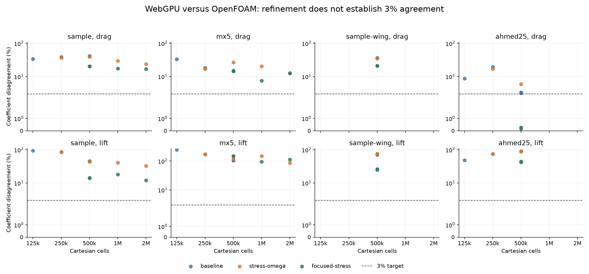

# WebGPU and OpenFOAM accuracy study

Stopped at the 100-iteration limit. The 3% target was not met.

0 of 8 final cases have both coefficients within 3%. Drag disagreement spans 3.1%–41.6%; signed-lift disagreement spans 44.2%–299.3%. 100 solves completed and 0 failed. The candidate controls remain experimental; the application's default numerical settings are unchanged.

## Final 500,000-cell comparisons

All final models use the same numerical configuration: the default mesh layout, four pressure multigrid cycles with 24 coarse sweeps, and 100 flow passes. The [selection record](selection.json) compares the same eight-model 80-pass suites. The default layout has the smaller worst force error (299.3% versus 474.3%), while the focused layout has healthier fields (8/8 versus 5/8); neither is a qualified candidate. The extra final trial repeats the sample car to check reproducibility.

Each error is absolute coefficient disagreement divided by the absolute OpenFOAM coefficient. Both drag and signed lift must pass. Browser forces are time-weighted over the final 30% of the requested flow passes; fresh native coefficients are averaged over the final 200 SIMPLE iterations. For a reference coefficient below 0.01, the scale is 0.01 and the absolute coefficient tolerance is 0.0003. This prevents a near-zero coefficient from being treated as a reliable relative percentage.

| Model | WebGPU cells | OpenFOAM Cd | WebGPU Cd | Drag error | OpenFOAM Cl | WebGPU Cl | Lift error | Both within 3% |
|---|---:|---:|---:|---:|---:|---:|---:|---|
| sample | 500000 | 0.51483 | 0.30200 | 41.3% | 0.64450 | 0.35931 | 44.2% | no |
| sample-yaw10 | 500000 | 0.60956 | 0.35591 | 41.6% | 0.71869 | 0.27062 | 62.3% | no |
| sample-wing | 500000 | 0.67784 | 0.43017 | 36.5% | 0.41586 | 0.11615 | 72.1% | no |
| mx5 | 500000 | 0.31908 | 0.27303 | 14.4% | 0.22679 | -0.01173 | 105.2% | no |
| z4 | 500000 | 0.44056 | 0.46122 | 4.7% | -0.31018 | -0.66762 | 115.2% | no |
| z4-wing | 500000 | 0.44423 | 0.48510 | 9.2% | -0.15397 | -0.61477 | 299.3% | no |
| simple-car | 500000 | 0.37051 | 0.38217 | 3.1% | 0.49258 | 0.12163 | 75.3% | no |
| ahmed25 | 500000 | 0.35817 | 0.37011 | 3.3% | 0.40448 | 0.04197 | 89.6% | no |


The two final sample runs differ by 0.0% in drag and 0.0% in lift. Both numbered results remain in the ledger.

The OpenFOAM sample reference uses the freshly generated Precise mesh; MX-5 uses a continued Medium mesh and Ahmed uses continued Precise. Other cases use the audited stored reference. Final errors are re-scored against the same current reference for each model, including earlier trials.

500,000 means the exact number of interior Cartesian cells, including solid cells and excluding ghost cells. Each raw result also records its actual fluid-cell count. OpenFOAM reports native fluid cells. Custom runs report one computed grid directly, with no averaging between grid levels or fitted force multiplier.

## What OpenFOAM does better

- Native surface-fitted cells and prism layers resolve wall-normal flow and narrow underbody gaps more directly. The tensor-product WebGPU grid spends cells throughout entire coordinate bands, so equal total cell counts do not mean equal wall resolution.
- The pinned OpenFOAM momentum equation includes both parts of the symmetric turbulent stress. The WebGPU baseline omits the transpose-gradient contribution. The full-stress candidate restores it.
- OpenFOAM 2412 uses stepwise omega wall blending by default. The WebGPU baseline uses binomial blending and applies log-layer production in the viscous branch. The stepwise candidate reproduces that switching rule and suppresses log-layer production in the viscous branch.
- OpenFOAM resolves wing profiles with a native volume mesh. The browser can thicken profiles or represent a part as a stepped zero-thickness wall; refinement does not guarantee that its lift converges.

These statements come from the pinned container source and local solver code. The official [stress implementation](https://api.openfoam.com/2506/linearViscousStress_8C_source.html) and [wall-function documentation](https://doc.openfoam.com/2606/tools/processing/models/turbulence/ras/wall-functions/) describe the governing treatment. The version actually executed is identified by its image digest in each fresh reference record.

The refined native sample receives more than 99% of its lift from pressure. The retained [pressure/viscous decomposition](pressure-force-diagnosis.json) shows that the main discrepancy is in pressure loading; wall friction alone cannot remove it.

## Experiments

The campaign includes isolated stress, omega, gradient, viscosity and pressure corrections; a cut-cell fluid-centroid wall distance; road-clearance refinement; and a mesh that shifts cells from the far field toward the car. Resolution increases through 125,000, 250,000, 500,000, one million and two million cells. Later runs increase the number of flow passes, use four pressure multigrid cycles and a deeper coarse solve to reduce projection error, and end with a new 500,000-cell suite.

The [geometry audit](geometry-audit.json) confirms matching fingerprints for all eight paired models. Every attempted model solve, including a failure, reserves one numbered iteration before launching. The driver refuses to exceed 100. This is a count of WebGPU development trials; native reference runs and software checks are recorded separately. Trials 4–100 retain source and input-STL SHA-256 hashes, settings, sampled force histories, full-history force-band statistics, wall integration checks, field diagnostics and comparison decisions in [iterations](iterations/). The three baseline imports retain the original Git revision and benchmark data; their field diagnostics were not collected and cannot satisfy the qualification gates.

[Attempt ledger](summary.json), [CSV comparison table](trials.csv), [final re-scoring](evaluation.json) and the `plan-*.json` files contain the full study. Runtime includes GPU work and preparation separately in each result. Some native reference solves ran concurrently, so these times are not isolated performance benchmarks.



The long MX-5 default-layout run retained one clipped face velocity and relative divergence of 0.00645 even with four pressure cycles. The focused mesh removed clipping and reduced relative divergence to 0.000315, but worsened lift disagreement to 147.7%. Passing the field-health check therefore did not establish force agreement.

## Reference qualification

The native force check uses the final 200 iterations with less than 1% span. Initial residuals must be below 0.0001 for pressure, velocity, k and omega. A finer-mesh comparison must change both coefficients by less than 1% before the reference is marked mesh independent. A candidate must also have force bands below 1%, finite fields, no velocity clipping and relative divergence below 0.001.

| Reference | Cells | Conditions match | Forces settled | Residuals converged | Mesh independence |
|---|---:|---|---|---|---|
| sample | 360000 | yes | no | no | no |
| mx5 | 165934 | yes | yes | no | pending |
| ahmed25 | 310851 | yes | yes | yes | pending |
| sample-wing | 265766 | yes | no | no | pending |
| sample-yaw10 | 193819 | yes | yes | no | pending |
| z4 | 309721 | yes | yes | yes | pending |
| z4-wing | 322045 | yes | yes | no | pending |
| simple-car | 149197 | yes | yes | no | pending |

Several historical references failed residual or force checks. Continuing a solve and checking a wider force window exposes these limits. The original Simple Car validation also compared a 100 km/h browser run against a 200 km/h Medium reference; `models.json` now uses the matching 200 km/h input.

Reference uncertainty remains separate from raw solver disagreement. Agreement with OpenFOAM is not proof of physical accuracy on other cars or conditions.

## Independent field checks

The final suite exports 243 wake locations on three planes behind each car. `accuracy-fields.py` probes the native OpenFOAM volume at the same coordinates. It records velocity relative L2 error and pressure-coefficient RMS error, with valid-point counts. These are final-state snapshots, separate from the averaged force comparison. [Final field comparisons](field-comparisons.json) and [refinement snapshots](field-comparisons-refinement.json).

| Iteration | Model | Valid wake points | Velocity L2 error | Cp RMS error |
|---:|---|---:|---:|---:|
| 92 | sample | 243/243 | 12.4% | 0.01701 |
| 93 | sample-yaw10 | 243/243 | 10.1% | 0.01620 |
| 94 | sample-wing | 243/243 | 14.6% | 0.01754 |
| 95 | mx5 | 243/243 | 11.5% | 0.01794 |
| 96 | z4 | 243/243 | 16.0% | 0.04215 |
| 97 | z4-wing | 243/243 | 18.0% | 0.04589 |
| 98 | simple-car | 243/243 | 21.7% | 0.05247 |
| 99 | ahmed25 | 243/243 | 19.3% | 0.04755 |
| 100 | sample | 243/243 | 12.4% | 0.01701 |

## Software validation

The solver unit suite passed 49 tests; the production TypeScript/Vite build passed. Browser tests passed 14 cases and skipped three fixture-gated cases: imported-car aerodynamics, native OpenFOAM analysis, and saved wheel-axle recovery. These checks cover implementation and application behavior; numerical qualification is assessed by the comparison and convergence gates above.

## Reproduce

Run from `web/` with the local `.easycfd/runs` geometry store available:

```sh
node validation/run-accuracy.mjs --plan ../docs/webgpu-accuracy/plan-screen.json
node validation/run-accuracy.mjs --plan ../docs/webgpu-accuracy/plan-250k.json
node validation/run-accuracy.mjs --plan ../docs/webgpu-accuracy/plan-centroid.json
node validation/run-accuracy.mjs --plan ../docs/webgpu-accuracy/plan-refinement.json
node validation/run-accuracy.mjs --plan ../docs/webgpu-accuracy/plan-long.json
node validation/run-accuracy.mjs --plan ../docs/webgpu-accuracy/plan-final.json
node validation/report-accuracy.mjs
```

Existing numbered trials are resumed without rerunning them. For a new campaign, copy this study's `references.json` into a new directory and pass that directory with `--output`; use a separate checkout or evidence folder to preserve this campaign. The three initial reduced-grid baseline trials are imported from the unchanged `7903a4b` solver and count toward this study's limit.

Native reference and field commands run from the repository root:

```sh
PYTHONPATH=backend .venv/bin/python web/validation/accuracy-reference.py --iterations 3000
PYTHONPATH=backend .venv/bin/python web/validation/accuracy-reference.py --models sample --iterations 3000 --refine
PYTHONPATH=backend .venv/bin/python web/validation/accuracy-fields.py
```

Native case folders are saved under `.accuracy-reference/` and excluded from Git. The first refined setup attempted an optional potential-flow initialization without a Phi solver entry; its failure log is retained. Recovery uses the same direct simpleFoam initialization as the application and reuses the checked mesh.
