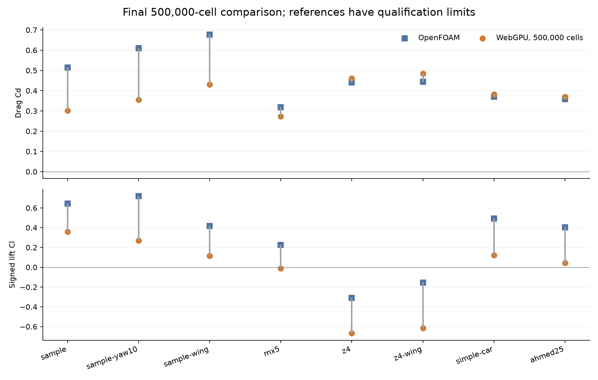
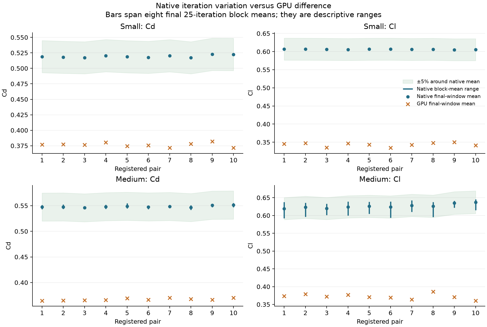

# WebGPU and OpenFOAM investigation

The experiments did not produce a WebGPU solver that agrees with OpenFOAM within 3% or 5% across the tested cars. Changes that improved one car made other cars worse. The proposed application change keeps an initialization error check and buffer cleanup. It excludes the experimental momentum, SST, wall and mesh paths from production.

This report records the completed investigations through 3 October 2026. It separates measured solver disagreement, implementation checks and aerodynamic qualification. Agreement with an unconverged reference is not a physical accuracy claim.

## What is worth keeping

| Change | Evidence | Decision |
|---|---|---|
| Catch GPU validation errors while constructing the solver | The hardware regression injects invalid WGSL. The original solver submits the initial projection anyway; the revised solver reports the initialization error and submits nothing. | Keep in `run.ts`. |
| Release buffers when solver construction throws | An injected synchronous shader-construction failure leaks 39 buffers in the original solver. The revised constructor releases all 39, and the caller balances its error scope. A separate buffer-upload exception verifies cleanup during allocation. | Keep in `gpu.ts`. |
| Match the Simple Car benchmark speed to its reference | The previous browser input was 100 km/h, while the selected OpenFOAM Medium reference was 200 km/h. Geometry and force normalization alone do not make these the same physical case. | Keep the 200 km/h input in `validation/models.json`. |
| Implicit momentum/SIMPLEC, implicit SST and source-derived wall corrections | Operator checks passed, but the eight-car 500,000-cell suite had no pair with both coefficients within 5%. Several cars became worse. | Exclude from the application change. |
| Geometric cut fractions, centroid wall distances and exact grid budgets | Analytic geometry checks passed and some car results improved. There is no demonstrated general force-accuracy improvement. | Retain as archived experiments. |
| Parameter sweeps, larger grids and per-trial controls | The campaigns exhausted their registered limits without meeting their targets. | Keep records and reproduction tools in the archive. |

The retained code improves failure handling and benchmark validity. It does not improve measured aerodynamic agreement. No coefficient correction factor or experimental numerical setting is promoted into the application.

## Evidence and source identity

The experiment base was `7903a4b`, the aerodynamic-analysis branch used for the studies. This review is based on `main` at `2dfe696`; it does not include the separate aerodynamic-analysis PR.

The complete archive is [commit 3fa3c8b](https://github.com/markthebault/easy-cfd/tree/3fa3c8b), retained on `archive/webgpu-accuracy-investigation`. It contains every numbered attempt, including failures, the original reports, plans, source history and validation scripts. The archive is historical evidence, not a proposed solver upgrade.

[Evidence index](evidence-index.json) records original paths, immutable archive URLs and SHA-256 values. The 32 evidence files copied into this PR retain their original bytes. Summaries, CSV rows, actual-input audits and plots can be reviewed here; the larger force histories and wake arrays remain in the archive.

The OpenFOAM execution used v2412 from:

```text
opencfd/openfoam-default@sha256:1ba02114b1c025c370f2e269a07677c16c9bea8d990fcd75ac8378aff9d41b50
```

The final experimental GPU revision was `2e3794f0000ae17cc5ab34c722b3e2654564ffa2`. WebGPU ran on Apple M1 hardware, adapter `apple metal-3`. The pinned [source audit](evidence/webgpu-openfoam-algorithm/source-audit.json) records native source paths, their hashes and actual solver dictionaries. Reproducing an earlier experiment requires its recorded source revision or snapshot; rerunning its plan against the final source changes the experiment. Some early uncommitted source snapshots have only their digests preserved.

## First campaign: 100 attempts, 3% target

All 100 ledger entries are completed results, with no failed solves. The first three entries imported previously collected baseline results from the unchanged `7903a4b` solver; the remaining 97 are new trials. The study covered the sample car, sample yaw and wing variants, MX-5, Z4, Z4 with a wing, Simple Car and Ahmed 25 degrees.

Runs increased through 125,000, 250,000, 500,000, one million and two million Cartesian cells. Later trials extended flow passes and strengthened the pressure multigrid solve. The final eight-model suite used exactly 500,000 interior grid cells, four pressure cycles, 24 coarse sweeps and 100 flow passes. Solid cells are included in these grid counts; ghosts are excluded. Native counts are fluid cells on a different mesh.

The trial ledger includes isolated turbulent-stress, omega-blending, gradient, viscosity, pressure-scaling and centroid-distance changes. It also covers road-clearance refinement and redistribution of cells toward the car. All final runs used one selected configuration. None passed both coefficient bounds.

[Evaluation](evidence/webgpu-accuracy/evaluation.json), [100-row ledger](evidence/webgpu-accuracy/trials.csv), [reference records](evidence/webgpu-accuracy/references.json) and [mesh/configuration selection](evidence/webgpu-accuracy/selection.json) retain the measured outcomes.



## Second campaign: OpenFOAM source review, 50 attempts, 5% target

The source review inspected `simpleFoam/UEqn.H`, `pEqn.H`, SST transport, viscous stress, wall functions, rotating-wall velocity, gradient limiting and boundary-condition code from the pinned image.

The experimental implementation added an under-relaxed implicit momentum matrix, pressure mobility derived from its diagonal, SIMPLEC pressure corrections, pseudo-time damping and implicit SST transport. Omega was solved before k; both k destruction and the production cap then used the newly solved omega. Further trials changed face diffusion, deviatoric production, limited gradients, side-patch pressure mixing, rotating-wall tangency and cut-cell geometry.

There were 50 attempted solves: 41 completed and nine failed. Seven failures came from a live source edit that left a queued batch with an inconsistent shader interface. They count toward the limit. Later runs froze all TypeScript sources at one committed revision and stopped on initialization failure. The remaining failures and their errors are retained in the [ledger](evidence/webgpu-openfoam-algorithm/trials.csv).

Both momentum paths compiled on hardware. An independent manufactured scalar solution, including the active k-production cap, gave maximum k and omega errors of `2.384185791015625e-7` and maximum residual `2.2348747279465897e-6`. [Kernel records](evidence/webgpu-openfoam-algorithm/kernel-validation.json) and [checks](evidence/webgpu-openfoam-algorithm/checks.json) record this test. It executes zero CFD steps and validates the scalar operator, not car aerodynamics.

The selected final configuration retained explicit momentum projection, implicit SST and geometric cut cells. Every final car used 500,000 grid cells and 40 flow passes. The full implicit momentum/SIMPLEC comparison remains in archive attempts 34 through 41.

The following errors compare each final suite with its matched native reference. Both coefficients must pass for a case to pass.

| Model | First campaign drag error | First campaign lift error | Source-review drag error | Source-review lift error |
|---|---:|---:|---:|---:|
| Sample | 41.3% | 44.2% | 21.8% | 15.0% |
| Sample, yaw 10 degrees | 41.6% | 62.3% | 23.4% | 44.7% |
| Sample with wing | 36.5% | 72.1% | 23.1% | 29.2% |
| MX-5 | 14.4% | 105.2% | 24.2% | 126.4% |
| Z4 | 4.7% | 115.2% | 14.9% | 193.3% |
| Z4 with wing | 9.2% | 299.3% | 14.0% | 428.8% |
| Simple Car | 3.1% | 75.3% | 6.8% | 55.4% |
| Ahmed 25 degrees | 3.3% | 89.6% | 3.6% | 40.6% |

These are complete configurations with different run lengths, rather than an isolated attribution test for each code change. They show why the combined experimental path cannot be promoted as a general improvement. Both final suites passed zero of eight cases. Lift errors above 100% can arise from the wrong sign or an exaggerated magnitude. The calculation preserves signed lift, with a denominator floor of 0.01 near zero.

The final independent sample repeat differed by 0.0021% in Cd and 0.0003% in Cl. Repeatability of the browser result did not establish agreement. [Final evaluation](evidence/webgpu-openfoam-algorithm/evaluation.json) retains all final values and gates.

Native volume probes at 243 matched wake points per case gave velocity relative L2 errors of 8.5% to 20.3% and Cp RMS errors of 0.0164 to 0.0452. Those are final-state snapshots, separate from the time-averaged force checks. The [full wake comparison](https://github.com/markthebault/easy-cfd/blob/3fa3c8b/docs/webgpu-openfoam-algorithm/field-comparisons.json) includes every point.


## Third investigation: ten paired inputs at each resolution

The statistical pilot ran 20 independent native starts and 20 independent GPU starts. Each resolution used the same ten speed/yaw combinations on the sample car: 95.5 to 104.5 km/h and -1.8 to +1.8 degrees. These are bounded, stratified input changes, not repeated identical-input tests or a calibrated population Monte Carlo.

The [registered design](evidence/webgpu-paired-inputs/design.json) fixed the solver revision, numerical options, tolerance and escalation gate before collecting results. No per-case parameter tuning or native field initialization was allowed. Native meshes were built once per resolution and held fixed across the input changes, including their baseline wall-layer thickness. Each native case started from fresh uniform fields; each GPU case started from freestream and an initial projection.

| Stage | Native fluid cells | GPU grid cells | GPU active fluid cells |
|---|---:|---:|---:|
| Small | 41,417 | 62,500 | 59,516 |
| Medium | 193,819 | 250,000 | 237,206 |

Errors were calculated within each matched pair before aggregation:

```text
signed error percent = 100 * (GPU - native) / max(abs(native), 0.01)
absolute error percent = abs(signed error percent)
```

Quartiles use linear interpolation at index `(n - 1) * p`. Each entry is Q1 / median / Q3.

| Stage | Drag coefficient absolute error | Lift coefficient absolute error | Pairs with both errors at most 5% |
|---|---:|---:|---:|
| Small | 27.00 / 27.28 / 27.68% | 42.70 / 43.20 / 43.60% | 0/10 |
| Medium | 32.76 / 33.09 / 33.33% | 39.66 / 40.34 / 41.41% | 0/10 |

Both coefficients were consistently underpredicted. OpenFOAM's coefficient IQR divided by its median was 0.52% for small drag, 0.13% for small lift, 0.24% for medium drag and 0.72% for medium lift. Raw drag/lift force IQRs were about 9% to 10%, which includes the expected speed-squared scaling. That raw-force spread is not evidence of solver randomness.

All 20 [actual-input audits](evidence/webgpu-paired-inputs/input-audit.json) passed. They checked STL files, dictionary velocity, density, force normalization and directions, domain bounds, moving-road speed, wheel rotation, turbulence and unchanged stage meshes. Every GPU field was finite, unclipped and conserved; maximum relative divergence was `0.00015235812008570595`. Nineteen of 20 GPU runs passed the force stability checks.

Native convergence limits remained. All ten small native force windows settled, but only six met the residual thresholds. None of the ten medium native runs settled or converged after 2,400 iterations. Their final-200 lift spans had Q1 / median / Q3 of 8.17 / 9.34 / 10.94%. These are iteration-window spans, not confidence intervals. No GPU mean fell inside its native range of eight final 25-iteration block means, for either drag or lift.

The paired fixed-input Small-to-Medium changes were 5.54% median drag and 3.11% median lift in OpenFOAM, and 2.83% and 8.31% in WebGPU. Mesh independence was not demonstrated for either solver.

The 500,000-cell statistical stage was not run because both smaller stages failed the registered gate. This does not undo the 500,000-cell suites already completed in the two earlier campaigns.

A larger input Monte Carlo would estimate the distribution of the observed bias. These narrow ten-point results do not justify treating input variation as the cause of the solver disagreement. A population uncertainty study also needs defensible input distributions. Native convergence and the numerical discrepancy should be addressed first.

[Paired CSV](evidence/webgpu-paired-inputs/pairs.csv), [full statistics](evidence/webgpu-paired-inputs/statistics.json) and [execution checks](evidence/webgpu-paired-inputs/checks.json) contain the complete descriptive results.




## Why the formulas did not produce the same answer

The source review confirmed remaining structural differences. It did not isolate a single cause that explains every model.

| Mechanism | OpenFOAM reference | Browser and experimental paths | Implication |
|---|---|---|---|
| Wall mesh | Conforming polyhedral cells with prism layers | Stretched Cartesian cut cells and optional zero-thickness thin walls | Equal total cells do not give equal wall-normal resolution or the same wing/underfloor geometry. |
| Momentum and pressure | Relaxed collocated momentum matrix, pressure field relaxation of 0.3, native pressure/flux construction and SIMPLEC | Production explicit staggered projection; experimental matrix used estimated dual apertures and Cartesian pressure coordinates without the native pressure relaxation | Copying SIMPLEC algebra does not reproduce the native discrete operator. |
| Diffusion and gradients | Limited non-orthogonal corrections and native vector convection limiting | Cartesian diffusion and scalar convection corrections | The matrices still differ on curved surfaces and stretched grids. |
| Linear solves | Residual-controlled GAMG and smoothSolver | Fixed multigrid cycles and Jacobi sweep counts | A correct local formula can leave a different global residual or steady state. |
| Wall/turbulence treatment | Native wall distances, interpolation, stress and wall functions | Estimated distances and geometry; experimental changes corrected selected terms | Local operator checks cannot establish the resulting surface-pressure accuracy. |
| Native references | Several cases lack residual convergence or a mesh-independence result | GPU forces compared with the recorded native averages | The measured disagreements are real comparisons, but their percentages are not certified aerodynamic error bars. |

The [pressure/viscous decomposition](evidence/webgpu-accuracy/pressure-force-diagnosis.json) provides a useful diagnostic. In the refined sample reference, pressure supplies Cl `0.64148` of total Cl `0.64450`, more than 99%. The 500,000-cell baseline GPU pressure contribution is only `0.35877`. Changing skin friction alone cannot account for that pressure-loading gap. This observation does not establish which remaining discretization change would resolve it.

One earlier source claim was corrected: the native v2412 dictionary constructor selects binomial omega blending with exponent two. The first campaign's statement that stepwise blending was the default was incorrect. The source-review campaign retained binomial blending. The original archived report preserves the earlier statement; this report and the source audit record the correction.

No native reference is described here as experimentally validated, and the adapted Ahmed case is not claimed to reproduce an identical upstream experiment. Healthy fields, reproducible output and matching source formulas are separate from aerodynamic qualification.

## Tests for the retained PR changes

The production TypeScript/Vite build passed, and all 31 tests on this `main`-based branch passed. The original experimental branch had a different test suite; its recorded 49/53-test checks remain in the archive and are not substituted for testing this PR.

The real-hardware [baseline regression record](pr-checks/initialization-baseline.json) fails three expected checks: invalid shader initialization reaches a projection submission, a synchronous shader-construction failure releases zero of 39 buffers, and an exception during the first buffer upload leaks that buffer. The [revised regression record](pr-checks/initialization-current.json) passes all four cases. Valid kernels reach cancellation, invalid kernels stop before projection, and every allocated buffer is released. Error scopes are balanced. These checks execute zero CFD steps and produce no aerodynamic results. They demonstrate a reliability improvement without claiming new force accuracy.

From `web/`:

```sh
npm test
npm run build
node validation/check-initialization.mjs
node validation/check-initialization.mjs --revision 2dfe696
```

The last command should exit with status 1 on the baseline. Hardware WebGPU is required; a software adapter cannot satisfy the check.

From the repository root:

```sh
python3 web/validation/verify-investigation.py
```

This verifies unchanged evidence hashes, campaign counts, all 20 input audits, the benchmark speed correction and independently recomputed quartiles using Python's standard-library inclusive quantiles.

## Reproducing the experiments

Use a separate checkout of the [archive commit](https://github.com/markthebault/easy-cfd/tree/3fa3c8b). Each [original study report](https://github.com/markthebault/easy-cfd/blob/3fa3c8b/docs/webgpu-accuracy/README.md), [source-review report](https://github.com/markthebault/easy-cfd/blob/3fa3c8b/docs/webgpu-openfoam-algorithm/README.md) and [paired-pilot report](https://github.com/markthebault/easy-cfd/blob/3fa3c8b/docs/webgpu-paired-inputs/README.md) contains its recorded plans and commands. Run reproductions in a new evidence directory; the exhausted ledgers are immutable and cannot be resumed with a higher limit.

Imported STL fixtures live in the local `.easycfd/runs` store and are not redistributed in Git. Their filenames and hashes are recorded. Full native mesh/field/log folders remain under the local ignored `.accuracy-reference/` directory, including the 20 paired cases. Reproducing imported-car CFD requires those fixtures, the pinned Docker image and hardware WebGPU. The retained PR regression uses the built-in sample and needs no external fixture.

Before another accuracy campaign, establish settled native references and mesh sensitivity, then isolate momentum/pressure and wall-geometry operators with independent conservation and manufactured-solution checks. Test each candidate on several car shapes and signed lift before choosing one configuration. Additional iterations or cells alone did not meet the requested accuracy bounds in these campaigns.
