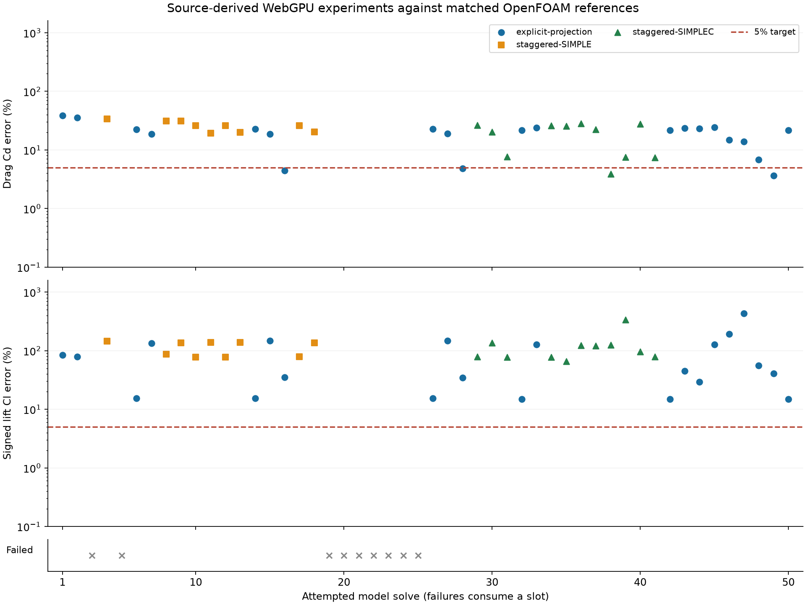
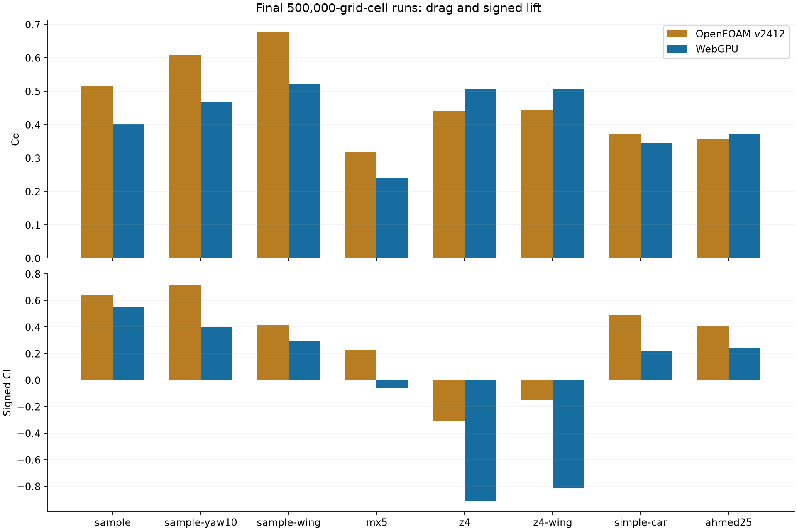

# WebGPU / OpenFOAM algorithm study: 5% target, 50-attempt limit

Stopped at the requested 50 attempted simulations. 41 completed; 9 failed. The final suite has not met the requested target. 0/8 final cases meet both coefficient bounds. Both drag and signed lift must have a relative error strictly below 5%; opposite-sign lift cannot pass. A relative-error denominator floor of 0.01 applies near zero.

This follow-up is separate from the [previous 100-attempt, 3% study](../webgpu-accuracy/README.md). The new campaign manifest fixes its limit and tolerance on first use; resuming cannot raise either. Every attempted model solve, including failed initialization or divergent flow, uses one slot. Raw attempts, geometry SHA-256 values, solver settings, source SHA-256 values and wake samples remain in [iterations](iterations/). Attempts 14–25 used a per-trial source snapshot. A queued batch captured an incomplete shader interface after a live source edit and attempts 19–25 failed initialization; those seven failures remain in the count. From attempt 26 onward, Vite loads all TypeScript sources from one committed revision for the whole plan, and the runner stops at the first kernel initialization failure. The recorded [kernel validation](kernel-validation.json) compiles both momentum paths and checks the SST scalar operator with zero fluid steps before a new revision is used. Earlier attempts used a fresh document/device and disabled HMR, with the source digest captured immediately before launch.

## What the source review changed

The audit uses the source installed in the pinned OpenFOAM v2412 image, not a different online release. [Source identities and case dictionaries](source-audit.json) retain the exact image digest and hashes of the inspected files. The native case uses bounded linearUpwindV momentum convection, cellLimited Gauss velocity gradients, implicit upwind SST transport, limited non-orthogonal diffusion, SIMPLE consistent=yes, momentum/k/omega relaxation 0.7 and pressure relaxation 0.3.

The experimental WebGPU path independently implements an implicit staggered finite-volume momentum matrix, relaxed at assembly. Linear upwind corrections are deferred to its source. Jacobi sweeps solve the momentum predictor with the previous pressure. Its pressure mobility comes from the same matrix diagonal, and the Galerkin pressure hierarchy is rebuilt on the GPU. The SIMPLEC option uses the diagonal minus the neighbour-coefficient sum, and includes the old-pressure correction in the predictor before solving for the new pressure. Pseudo-time damping stabilizes difficult starts without importing native fields.

The implicit SST option assembles bounded upwind transport, diffusion and destruction into relaxed scalar matrices. It solves omega first, uses the new omega in the k destruction term and production cap, then updates eddy viscosity. Independent affine manufactured solutions check the GPU scalar solver and this omega-to-k coupling, including an active production cap. These checks validate the operator, not aerodynamic accuracy.

Other source-derived changes interpolate SST effective diffusivity at faces; use deviatoric production and conservative flux divergence for SST source terms; limit velocity gradients; use signed-distance wall geometry for SST blending; and match direction-dependent side pressure mixing and inlet/outlet velocity/turbulence conditions. Pressure integration uses the actual cell when pressure merging is disabled. Rotating-wall velocity is projected onto the tangent plane for SST gradients. An optional clipped-tetrahedron geometry method integrates fluid volume and centroid and uses compatible clipped-triangle face areas. Road shear and SST wall distance can use the fluid centroid height rather than half the full cell width; a configurable floor avoids overstating wall distance in sliver cells.

**Correction to the earlier study:** its claim that stepwise omega blending matched this case's default was wrong. The dictionary constructor in v2412 selects binomial blending of exponent two. This campaign keeps binomial blending.

The formulas and algorithms can be implemented on WebGPU. This experimental implementation still differs in discretization: it uses a Cartesian staggered cut-cell mesh, estimated dual-cell apertures, Cartesian diffusion and pressure coordinates, scalar convection limiting and fixed Jacobi sweeps. Native OpenFOAM uses a conforming collocated polyhedral mesh with wall layers, vector convection limiting, non-orthogonal corrections and residual-controlled matrix solves. Native pressure field relaxation of 0.3 and its separate collocated flux construction are also still absent. Copying turbulence formulas alone does not reproduce the native matrices on a different mesh. The source audit records these remaining differences.

## Final 500,000-cell comparison

| Model | Native Cd | WebGPU Cd | Drag error | Native Cl | WebGPU Cl | Lift error | Stable, finite, conserved |
|---|---:|---:|---:|---:|---:|---:|---|
| sample | 0.51483 | 0.40273 | 21.8% | 0.64450 | 0.54801 | 15.0% | yes |
| sample-yaw10 | 0.60956 | 0.46717 | 23.4% | 0.71869 | 0.39726 | 44.7% | no |
| sample-wing | 0.67784 | 0.52150 | 23.1% | 0.41586 | 0.29458 | 29.2% | yes |
| mx5 | 0.31908 | 0.24188 | 24.2% | 0.22679 | -0.05996 | 126.4% | no |
| z4 | 0.44056 | 0.50610 | 14.9% | -0.31018 | -0.90979 | 193.3% | yes |
| z4-wing | 0.44423 | 0.50634 | 14.0% | -0.15397 | -0.81426 | 428.8% | yes |
| simple-car | 0.37051 | 0.34534 | 6.8% | 0.49258 | 0.21975 | 55.4% | no |
| ahmed25 | 0.35817 | 0.37124 | 3.6% | 0.40448 | 0.24043 | 40.6% | no |

Each final run uses 40 flow passes on exactly 500,000 interior Cartesian grid cells, including solid cells and excluding ghosts. Development runs grew from 125,000 and 250,000 cells to 500,000 cells, then increased from 20 to 30 and 40 passes. Actual fluid counts are recorded separately in evaluation.json and each attempt. Geometry, speed, yaw, reference area, density, moving ground and wheel settings match each native reference. [Actual native STL and input checks](geometry-input-audit.json) verify all eight pairs. [Domain bounds](domain-audit.json) compare the actual native tunnel to the browser tunnel, with a 1e-5 metre tolerance for imported float32 geometry. Native meshes have their own fluid-cell counts. All GPU solves start from freestream plus an initial divergence-free projection; no OpenFOAM velocity, pressure or turbulence result is supplied to the solver.

The final configuration was selected using mean relative drag and signed-lift error on the matched sample and MX-5 cases, requiring finite conserved fields; longest available run per candidate. Selected: **geometric-projection**. Selection is based on the recorded comparisons, not per-model fitted correction factors. The selected final path retains projection momentum and uses implicit SST with 4 scalar sweeps, four pressure multigrid cycles, 24 coarse sweeps, geometric cut fractions and fluid-centroid road distances. The eight-case full implicit momentum/SIMPLEC suite is retained as attempts 34–41.

The independent sample repeat differed by 0.0021% in Cd and 0.0003% in Cl. Exact differences are in evaluation.json.





## Best individual 500,000-cell attempts

The rows below may use different settings. They describe the search, not one qualified general-purpose solver.

| Model | Native Cd | WebGPU Cd | Drag error | Native Cl | WebGPU Cl | Lift error | Stable, finite, conserved |
|---|---:|---:|---:|---:|---:|---:|---|
| sample | 0.51483 | 0.40274 | 21.8% | 0.64450 | 0.54801 | 15.0% | yes |
| sample-yaw10 | 0.60956 | 0.46717 | 23.4% | 0.71869 | 0.39726 | 44.7% | no |
| sample-wing | 0.67784 | 0.52150 | 23.1% | 0.41586 | 0.29458 | 29.2% | yes |
| mx5 | 0.31908 | 0.24756 | 22.4% | 0.22679 | -0.04899 | 121.6% | yes |
| z4 | 0.44056 | 0.42356 | 3.9% | -0.31018 | -0.70089 | 126.0% | yes |
| z4-wing | 0.44423 | 0.41094 | 7.5% | -0.15397 | -0.67200 | 336.4% | yes |
| simple-car | 0.37051 | 0.34534 | 6.8% | 0.49258 | 0.21975 | 55.4% | no |
| ahmed25 | 0.35817 | 0.37534 | 4.8% | 0.40448 | 0.26507 | 34.5% | no |

## Wake fields and reference limits

| Case / iteration | Valid wake points | Velocity relative L2 error | Cp absolute RMS error |
|---|---:|---:|---:|
| sample / 42 | 243/243 | 8.6% | 0.0202 |
| sample-yaw10 / 43 | 243/243 | 12.9% | 0.0332 |
| sample-wing / 44 | 243/243 | 15.2% | 0.0192 |
| mx5 / 45 | 243/243 | 17.0% | 0.0164 |
| z4 / 46 | 243/243 | 18.3% | 0.0369 |
| z4-wing / 47 | 243/243 | 20.3% | 0.0452 |
| simple-car / 48 | 243/243 | 16.4% | 0.0428 |
| ahmed25 / 49 | 243/243 | 13.2% | 0.0441 |
| sample / 50 | 243/243 | 8.5% | 0.0207 |

Coefficient agreement is checked separately from physical qualification. Healthy fields require finite values, no velocity clipping, relative divergence at most 0.001, settled forces and final force bands at most 1%. The native sample reference still has unresolved force/residual and mesh-convergence limits; native MX-5 still has unresolved residual/mesh-convergence limits; Ahmed has settled forces and converged residuals but no demonstrated mesh independence. None of these are promoted to a physical 5% accuracy claim. The pinned native references were reused from the preceding campaign; no changed geometry or numerical target was introduced to manufacture agreement.

## Validation and reproduction

[Recorded checks](checks.json) retain the production build, 53 passing CPU tests, Python and JavaScript checks, kernel compilation and independent GPU scalar-operator validation. These software checks passed; the CFD target did not. Native input and field audits are separate records.

The plans and every raw attempt retain their settings. Reproducing a committed experiment requires its recorded sourceRevision; using the final source for an earlier plan changes the experiment. Attempts 1–25 include uncommitted development snapshots identified by source digests, so those historical versions are not advertised as fully reproducible from the final commit.

To reproduce the final suite in a separate folder from web/ (the archived 50 attempts are immutable):

```sh
mkdir -p ../docs/webgpu-openfoam-reproduction
cp ../docs/webgpu-openfoam-algorithm/references.json ../docs/webgpu-openfoam-reproduction/references.json
node validation/run-accuracy.mjs --plan ../docs/webgpu-openfoam-algorithm/plan-kernel-check.json --output docs/webgpu-openfoam-reproduction --limit 50 --tolerance 0.05 --validate-only true --revision 2e3794f0000ae17cc5ab34c722b3e2654564ffa2
node validation/run-accuracy.mjs --plan ../docs/webgpu-openfoam-algorithm/plan-final.json --output docs/webgpu-openfoam-reproduction --limit 50 --tolerance 0.05 --revision 2e3794f0000ae17cc5ab34c722b3e2654564ffa2
```

The source tree must include the retained local geometry fixtures referenced by validation/models.json. The source hash, reference hashes, domains and input settings are separate checks. Resuming skips attempted keys, including failures. Hardware WebGPU is required; software adapters are rejected. No experimental numerical option is enabled in the application's production defaults.
