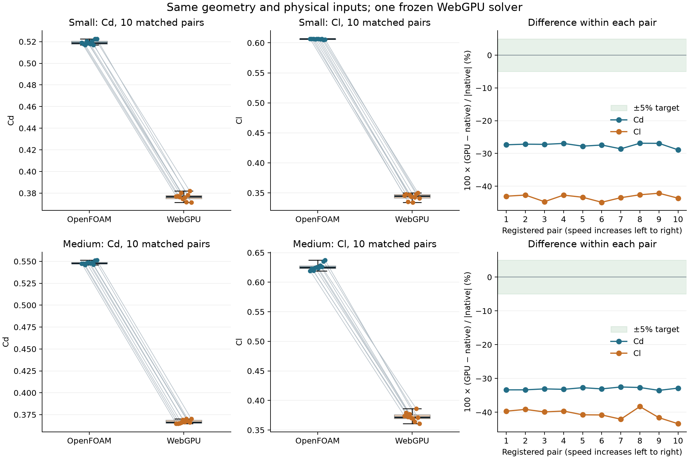

# Matched OpenFOAM/WebGPU input-variation pilot

The completed small and medium stages failed the registered 5% gate; the conditional 500,000-cell stage was not run.

Ten independent native and GPU starts at each tested resolution, using the same ten speed/yaw settings on one sample car. OpenFOAM's spread across those settings measures input sensitivity. Iterative drift is recorded separately; this is not a repeatability test with identical inputs.

Registered tolerance: 5% for both signed Cd and Cl in every pair, plus convergence and healthy-field checks. The 500,000-cell stage is conditional on both smaller stages passing. GPU source and settings are frozen across stages; reference fields are never supplied to the GPU.

Quartiles use linear interpolation at `(n-1)*p`. Entries below are **Q1 / median / Q3**. Errors are paired before summarizing, with `100*(GPU-native)/max(abs(native), 0.01)` for coefficients.

| Stage | Metric | OpenFOAM | WebGPU | Paired absolute error (%) |
|---|---|---|---|---|
| small | CD | 0.51779 / 0.51885 / 0.52048 | 0.37495 / 0.37668 / 0.37785 | 27.00 / 27.28 / 27.68 |
| small | CL | 0.60585 / 0.60638 / 0.60664 | 0.34147 / 0.34459 / 0.34752 | 42.70 / 43.20 / 43.60 |
| medium | CD | 0.54743 / 0.54788 / 0.54874 | 0.36545 / 0.36636 / 0.36886 | 32.76 / 33.09 / 33.33 |
| medium | CL | 0.62321 / 0.62502 / 0.62772 | 0.36968 / 0.37156 / 0.37596 | 39.66 / 40.34 / 41.41 |

| Stage | Pairs complete | Both coefficients within 5% | Convergence/field checks | Pass |
|---|---:|---:|---:|---|
| small | 10/10 | 0/10 | 6/10 | no |
| medium | 10/10 | 0/10 | 0/10 | no |

500,000-cell decision: **not eligible: both smaller stages must pass**.



| Stage | Native fluid cells | GPU grid cells | GPU active fluid cells |
|---|---:|---:|---:|
| small | 41,417 | 62,500 | 59,516 |
| medium | 193,819 | 250,000 | 237,206 |

## Native variability versus solver disagreement

| Stage | Metric | Native IQR / median (%) | Median absolute solver difference / native IQR | Native last-200 span, Q1 / median / Q3 (%) |
|---|---|---:|---:|---|
| small | CD | 0.52 | 52.54 | 0.02 / 0.03 / 0.04 |
| small | CL | 0.13 | 332.57 | 0.01 / 0.02 / 0.06 |
| medium | CD | 0.24 | 137.52 | 1.72 / 1.98 / 2.08 |
| medium | CL | 0.72 | 55.64 | 8.17 / 9.34 / 10.94 |

A broad Monte Carlo requires a justified input distribution. Ten bounded input changes cannot establish that a solver is generally accurate. Systematic paired errors larger than native input sensitivity remain solver differences, even if some pooled ranges overlap. Unsettled native cases limit the strength of a numerical accuracy conclusion and should be improved before an expensive uncertainty campaign.

Native and GPU grids have different topology, near-wall treatment and actual fluid-cell counts. Cell budgets describe resolution stages, not identical discretizations. OpenFOAM uses the app's Fast/Medium/Precise meshing presets, with a mesh built once per stage and reused unchanged for all ten input variations. Baseline layer thickness is held fixed. Each native solve starts from freshly generated uniform fields and each GPU solve from freestream plus projection.

Saved artifacts: [registered design](design.json), [full statistics](statistics.json), [paired rows](pairs.csv), per-stage plans, meshes, native records and GPU records. Full native meshes, fields and logs remain under `.accuracy-reference/paired-inputs/`.

The native variability records also count whether each GPU mean falls inside the range of the final eight native 25-iteration block means. This checks whether native within-solve variation is large enough to cover the GPU value; it is a descriptive envelope, not a confidence interval.

| Stage | Metric | GPU mean inside native block-mean range |
|---|---|---:|
| small | CD | 0/10 |
| small | CL | 0/10 |
| medium | CD | 0/10 |
| medium | CL | 0/10 |


## Physical forces under the same changed inputs

Force variation includes the expected speed-squared scaling. Coefficient errors above isolate the aerodynamic response from that scaling.

| Stage | Force (N) | OpenFOAM Q1 / median / Q3 | WebGPU Q1 / median / Q3 | Native IQR / median (%) |
|---|---|---|---|---:|
| small | drag | 514.66 / 538.97 / 563.06 | 374.95 / 390.24 / 409.33 | 8.98 |
| small | lift | 602.37 / 630.87 / 659.18 | 340.08 / 352.45 / 376.91 | 9.01 |
| medium | drag | 542.97 / 570.16 / 594.59 | 363.13 / 382.52 / 400.51 | 9.05 |
| medium | lift | 616.83 / 649.82 / 681.18 | 371.07 / 384.80 / 404.97 | 9.90 |

## Paired signed bias

| Stage | Metric | Signed error Q1 / median / Q3 (%) | Bootstrap median interval (%) |
|---|---|---|---|
| small | CD | -27.68 / -27.28 / -27.00 | -28.00 to -26.94 |
| small | CL | -43.60 / -43.20 / -42.70 | -44.10 to -42.66 |
| medium | CD | -33.33 / -33.09 / -32.76 | -33.37 to -32.73 |
| medium | CL | -41.41 / -40.34 / -39.66 | -41.61 to -39.42 |

These bootstrap intervals describe this selected ten-point design; the pilot is too small and too narrow to establish general solver equivalence.

## Pilot decision

Across 20 pairs, the GPU mean lies inside its native block-mean range in 0/20 drag comparisons and 0/20 lift comparisons. The paired differences must therefore be judged alongside both the input spread and native iteration variation, rather than pooled range overlap.

A broad randomized-input Monte Carlo is not supported as the next step by this pilot: both resolutions show a large paired bias. Additional samples of these ranges would refine its estimated distribution; they would not establish 5% agreement for the tested cases. Resolve the numerical discrepancy and native convergence before an expensive uncertainty campaign.

Unconverged native force windows/residuals and the absence of mesh independence limit a precise accuracy claim. Reported percentages compare measured solver averages on the registered inputs, not experimentally qualified aerodynamic truth.

## Change with mesh resolution at fixed physical inputs

The same ten input pairs are matched across Small and Medium. This measures grid sensitivity separately from changed-input variability.

| Solver | Metric | Small-to-Medium absolute change Q1 / median / Q3 (%) |
|---|---|---|
| native | Cd | 5.44 / 5.54 / 5.73 |
| native | Cl | 2.72 / 3.11 / 3.57 |
| gpu | Cd | 1.72 / 2.83 / 3.27 |
| gpu | Cl | 6.72 / 8.31 / 10.10 |

## Execution and validation

GPU solver source: `2e3794f0000ae17cc5ab34c722b3e2654564ffa2`. The exact experimental settings are in `design.json`; production defaults were not changed. Hardware adapter, source consistency, independent NumPy quartile checks, software checks and solve counts are recorded in [checks.json](checks.json). Software validation is separate from numerical agreement and aerodynamic qualification.

To regenerate the audit/statistics/figures from the saved cases in this checkout:

```sh
PYTHONPATH=backend .venv/bin/python web/validation/audit-paired-inputs.py
.venv/bin/python web/validation/paired-statistics.py
uv run --no-project --with matplotlib --with numpy python web/validation/plot-paired-inputs.py
```
