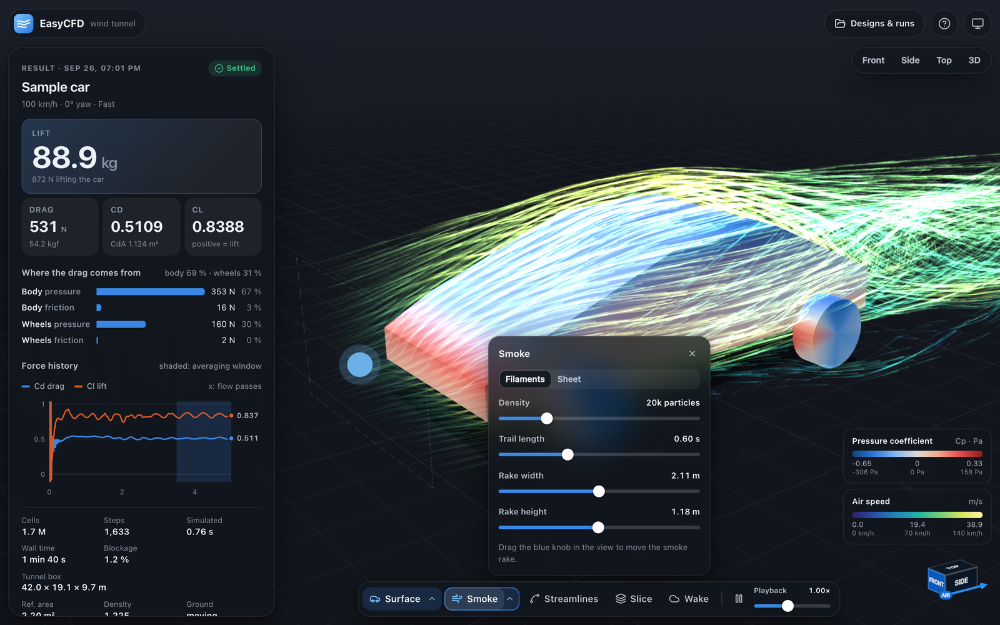

# EasyCFD Web

A virtual wind tunnel that runs entirely in the browser. Drop in a car, choose a speed, and the airflow is computed on your graphics card through WebGPU. There is no server, no OpenFOAM and no Docker: the app is a folder of static files, and your geometry never leaves the computer.



More views: [live solving](docs/02-live-solving.png) · [section plane](docs/04-slice.png) · [streamlines](docs/06-streamlines.png) · [wake volume](docs/07-wake.png) · [comparison](docs/05-compare.png) · [geometry step](docs/01-geometry.png)

## Run it

```sh
just run           # from the repository root: build and serve on http://127.0.0.1:4173
# or, for development with hot reload:
cd web && npm install && npm run dev   # http://127.0.0.1:5173
```

For a static build, `npm run build` writes `dist/`. Serve that folder from any static web server (WebGPU needs `https://` or `http://localhost`). Opening `index.html` from the file system does not work, because browsers do not allow module scripts and workers from `file://`.

Browsers: Chrome or Edge 113+, Safari 26+, Firefox 141+ on Windows. The app tells you if WebGPU is missing, or if the browser only offers a software fallback, which works but is 20–50× slower.

## Using it

1. **Car.** Drop STL, OBJ, GLB or glTF files anywhere on the page, or open the sample car (with an optional rear wing). Set units, which way the nose points, which way is up, and road clearance. Wheels are detected by name or shape; check them in the part list and set their radius. Parts are organised in groups (body, wheels, rear wing, one per added file) that you can rename, create and switch on or off, for example to run several wing versions from one import. Each group has a **Detail** setting (auto, always, off) that applies when detail cells are switched on. Confirm the checklist.
2. **Conditions.** Wind speed (5–300 km/h), crosswind yaw (±20°), reference area (with an exact frontal-area estimate), air density, independent **Moving road** and **Rotating wheels** checkboxes, an automatic or custom tunnel box, and **detail boxes**: regions with finer cells for features inside a larger part, such as vents or holes in the hood.
   Uncheck both motion boxes for a static wind tunnel with fixed road and wheels. Wind still flows at the selected speed. Both engines use these choices as wall boundary conditions, and each saved run keeps its own settings. Preview pause and playback controls only change the animation.
3. **Run.** Choose Fast, Medium or Precise, or Custom (cells along the car and number of flow passes). Optionally switch on experimental detail cells around aero parts. Medium, Precise and Custom runs extend themselves by up to 10 flow passes while forces are still drifting. The flow develops live on screen while forces converge.
4. **Results.** Lift or downforce in kg and N, drag, Cd and Cl with a ± band (the spread over the averaging window), where the drag comes from (body/wheels, pressure/friction), downforce and drag of each group, force history with a moving average and its min, median and max, and warnings. Visualise surface pressure, smoke, streamlines, a section plane (speed, pressure, total pressure, turbulence) and the wake volume.
5. **Compare.** Pick two runs to see them side by side with synchronised cameras, shared colour scales and the changes in drag, downforce, Cd and Cl, overall and per group. Every part whose own switch is on shapes the grid, even when its group is off, so variants of a design run on identical cells and Compare says so.

Designs and runs are saved in the browser (IndexedDB). Runs can be exported as JSON with a CSV of the force history, and the view as PNG.

## Engines

WebGPU (in the browser, the default) or OpenFOAM (the EasyCFD server, for final checks), chosen in the Run step.
- **When OpenFOAM is available:** opt in at build time with `VITE_ENABLE_OPENFOAM=true`, then serve from the OpenFOAM app; detected at `/api/health`. `just run-openfoam` and `scripts/start.sh` do this automatically. Default builds and `just run` disable backend calls and show “Coming soon: OpenFOAM runs on demand.”
- **Public deployment:** `just deploy-web` publishes a forced WebGPU-only build to https://easy-cfd.mthracelab.com using Cloudflare Pages. Models and results remain in browser storage.
- **Client:** `src/engine/openfoam.ts` is the server client and the mapping from server records to UI results. It measures the frame offset from the uploaded parts' bounds.
- **Run flow:** `src/store/openfoamRuns.ts` runs, follows and opens OpenFOAM runs.
- **Backend:** its endpoints for the viewer are in `backend/easycfd/webview.py`.

See the main README for what OpenFOAM runs include.

## The solver

| | |
|---|---|
| Equations | Steady incompressible RANS, k-ω SST (Menter 2003, OpenFOAM coefficients) |
| Boundary conditions | As in the OpenFOAM app: fixed-velocity inlet with 1 % turbulence, fixed-pressure outlet, freestream sides, symmetry top, moving road, rotating wheels, wall functions |
| Grid | Stretched Cartesian grid, finest around the car and near wake. Staggered velocities. Optional (experimental, off by default): detail bands with cells 2–4× finer along the axes in which a thin or small part (wing, endplate, canard, splitter) or a detail box is small, capped at 4.5 M cells. |
| Geometry | Cut cells: every cell and face crossed by the surface keeps its open fraction, from a signed distance field. Cells with a small fluid fraction are merged with a neighbour. Parts thinner than about 1.5 cells (measured along their own thin direction) are zero-thickness walls with their true outline and angle. Overlapping shells in one part stay solid (winding rule); wheels are never thin walls. |
| Time marching | Local time steps toward the steady state; the pressure is projected every step with a geometric multigrid solver |
| Forces | Pressure and wall shear on the cut surface, averaged over the last 30 % of the run, in total and per part |
| Tunnel | 3 car lengths upstream, 6 downstream, 2 to the sides and above (or a custom box) |

Presets on a 4.2 m car: Fast and Medium use a ≈ 1.7 M-cell grid (72 cells along the car); Fast stops after 5 flow passes, Medium after 10. Precise also solves a 2.5 M-cell grid and reports the mean of both. On an Apple M1: Fast 30–50 s, Medium 50–100 s, Precise 3–5 min. Detail cells (off by default) add cells and steps, 3–6× the run time: see [VALIDATION.md](VALIDATION.md#aero-parts-synthetic-kit-on-the-mx-5).

Accuracy against the OpenFOAM app, model by model, is recorded in [VALIDATION.md](VALIDATION.md), including the models that miss the ±10 % target.

## Development

```sh
npm test                 # CPU-side geometry and solver checks (Node)
npm run build            # type check and production build
npm run test:e2e         # browser test: sample car, short run, results, reload
npm run validate -- --quality medium   # full validation against OpenFOAM references
```

The validation reads geometry from the OpenFOAM app's local `../.easycfd/runs` folder, which is not part of the repository. `validation/models.json` lists the reference runs; `validation/report.mjs` turns a results file into the tables in VALIDATION.md.

Source layout: `src/solver` (grid, voxelisation, cut cells, WebGPU kernels, run driver), `src/geometry` (file readers, sample car), `src/viz` (three.js stage and visualisations), `src/ui` (React panels), `src/store` (state and IndexedDB), `src/workers` (grid preparation off the main thread).

## Dependencies

three.js (MIT) for rendering, React (MIT), lucide-react icons (ISC). Development only: Vite, TypeScript, Playwright, `@types/three`, `@webgpu/types`.
